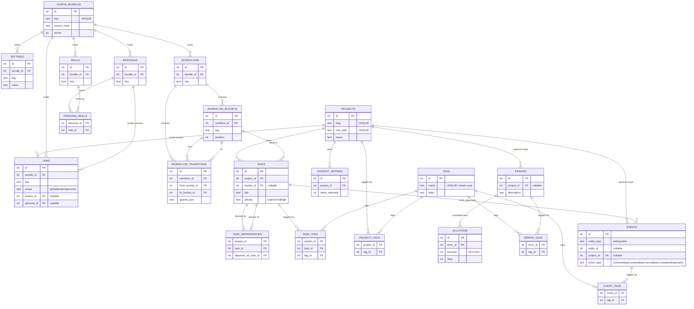

# Data Model Guide

Omakiten persists state in a single SQLite file (default `~/.local/share/omakiten/omakiten.db`, pure-Go driver `modernc.org/sqlite`). The schema is owned by the migration files under `migrations/` and applied transactionally on every connect (`internal/sqlite/store.go:Open`).

> **CQRS-like split.** YAML files (`omakiten.yaml` plus per-entity markdown) are the **write model** and source of truth for config. SQLite is the **read model** — repopulated on every `app.ConfigService.Import`. Operational data (tasks, comments, dependencies, context entries, errors, solutions, events, tags) is **born in SQLite** and has no YAML mirror.

## Migrations

Schema versions are tracked in `schema_migrations(version)`. Each numbered file under `migrations/` is applied once, in order:

| File | What it adds |
|---|---|
| `001_initial.sql` | Core tables: `projects`, `config_bundles`, `settings`, `skills`, `personas`, `persona_skills`, `laws`, `workflows`, `workflow_buckets`, `workflow_transitions`, `tasks`, `comments`, `task_dependencies`, `context_entries`. |
| `002_entities.sql` | Adds `description` / `body` / `source_path` to entity tables; introduces law `scope` (`global`/`project`/`persona`) with `project_id` / `persona_id` references; adds `tasks.workdir` / `tasks.branch`. |
| `003_activity_logs.sql` | `activity_logs` table for operational telemetry (since absorbed into `events`). |
| `004_tags.sql` | `tags`, `task_tags`, `project_tags` join tables. |
| `005_transition_guards.sql` | `workflow_transitions.guards_json` column (JSON-encoded guard list). |
| `006_comment_tags.sql` | `comment_tags` join table (since absorbed into `event_tags`). |
| `007_errors.sql` | `errors`, `solutions`, `error_tags`. Errors and solutions are intentionally **cross-project**. |
| `008_solution_likes.sql` | `solutions.likes` counter, incremented by `solutions.confirm(success=true)`. |
| `009_events.sql` | Unified `events` table; migrates `comments` and `activity_logs` into it; rekeys `comment_tags` as `event_tags`; **drops** `comments`, `comment_tags`, `activity_logs`. |
| `010_agent_attribution.sql` | Adds `agent_model` (NOT NULL DEFAULT '') and nullable `agent_session_id` to `events`, `errors`, and `solutions`; adds `source` / `entrypoint` to `errors` / `solutions`; creates `idx_events_agent_type(agent_model, event_type, created_at)` for the per-model benchmark queries. Existing rows are not backfilled — the domain-event timeline starts at this migration. |

After 009, three tables that older code referenced (`comments`, `comment_tags`, `activity_logs`) **no longer exist** — every reader/writer goes through `events` (see "The unified events table" below).

## Top-level relationships

The diagram below reflects the **post-migration-009** schema — i.e. `comments`, `comment_tags`, and `activity_logs` are gone, absorbed into the unified `events` table. Crow's-foot reads as: `||--o{` is one-to-many; pure-junction tables (`*_tags`, `persona_skills`, `task_dependencies`) sit between the two entities they link.



A few caveats the diagram cannot express compactly:

- **Project-scope invariant** for tasks: `tasks(project_id, id)` is a composite unique key, and `task_dependencies` uses dual composite FKs into it — this is what guarantees a dependency can never cross projects.
- **Cycle prevention** for `task_dependencies` is enforced in software (`internal/graph/dependency.go:HasCycle`), not by the schema.
- **Law scope is exclusive**: `(scope, project_id, persona_id)` is conceptually a tagged union — only one of `project_id` / `persona_id` is populated per row, depending on `scope`.
- **`events` is a discriminated log**: `(entity_type, event_type)` selects the row's role (see "The unified events table" below). `entity_id` is the task id when `entity_type='task'`, and is `NULL` for `entity_type='system'`.
- **`solutions.success`** is a tri-state (`NULL` = untried, `0` = known-bad, `1` = known-good); `1` is the only state that increments `likes`.

## Tables

### `projects`

`id INT PK`, `name`, `slug UNIQUE`, `root_path UNIQUE`, `description`, `created_at`, `updated_at`, `archived_at?`.

The active project is resolved by id, slug, or by matching `root_path` to the current working directory (`internal/project/resolver.go`).

### `config_bundles`

`id`, `key UNIQUE`, `name`, `version`, `scope ('global'|'project')`, `project_id?`, `source_path`, `source_hash`, `active`. The hash detects YAML drift on re-import.

### `settings`

`bundle_id`, `key`, `value`. Flattened key/value pairs (e.g. `workflow.active`, `theme.active`, `context.default_level`).

### `skills`, `personas`, `laws`, `workflows`, `workflow_buckets`, `workflow_transitions`

Bundle-scoped config tables. Each carries a `local_id` (the YAML id) and a `key` (slug), both unique within a bundle. `active=1` filters out anything no longer referenced by the current bundle.

- `laws.scope` is one of `global`, `project`, or `persona`. `project_id` and `persona_id` are populated only for the matching scope.
- `workflow_transitions.guards_json` is a JSON array following `domain.TransitionGuard` (see `.docs/guards-guide.md`).

### `tasks`

`id`, `project_id`, `bucket_id?`, `title`, `description`, `priority CHECK ('low','normal','high')`, `created_at`, `updated_at`, `completed_at?`, `workdir`, `branch`, `UNIQUE(project_id, id)`.

The `UNIQUE(project_id, id)` shape is what lets `task_dependencies` use a composite foreign key to enforce that **dependencies cannot cross projects**.

Index: `idx_tasks_project_bucket(project_id, bucket_id)`.

### `task_dependencies`

`(project_id, task_id, depends_on_task_id)` PK, with `CHECK (task_id != depends_on_task_id)` and dual FKs into `tasks(project_id, id)`. The `app.DependencyService` adds cycle detection in software (`internal/graph/dependency.go:HasCycle`) since SQLite cannot enforce DAG-ness.

### `context_entries`

`id`, `project_id`, `body`, `token_estimate`, `created_at`. Project-scoped handoff notes consumed by `context.dump` (`internal/app/context_service.go`).

### `tags`

`id`, `name UNIQUE` (kebab-case-normalized via `app.NormalizeTagName`), `label`, `created_at`.

Three join tables attach tags:

| Join | Reference |
|---|---|
| `task_tags` | `(project_id, task_id, tag_id)` |
| `project_tags` | `(project_id, tag_id)` |
| `error_tags` | `(error_id, tag_id)` |
| `event_tags` | `(event_id, tag_id)` — used to tag comments (which are events) |

`tags.merge` reassigns rows from one tag id to another and deletes the source. Orphan tag cleanup is exposed via `TagRepository.DeleteOrphanTags`.

### `errors`, `solutions`, `error_tags`

```
errors:    id, description, context, project_id?, created_at,
           source, entrypoint, agent_model, agent_session_id?
solutions: id, error_id (FK), description, steps, success NULL|0|1, task_id?,
           tried_at?, created_at, likes,
           source, entrypoint, agent_model, agent_session_id?
error_tags: error_id, tag_id
```

**Cross-project by design.** Errors carry an optional `project_id` (so you can filter), but `errors.search` and `solutions.list_top` are global so prior fixes are reusable across projects (see `.docs/mcp-guide.md` §Tools).

`solutions.success` is a tri-state:

- `NULL` — recorded but never tried.
- `0` — known-bad (the agent should not retry without new context).
- `1` — known-good — increments `solutions.likes` (`migration 008`).

The `source` / `entrypoint` / `agent_model` / `agent_session_id` columns (`migration 010`) denormalize the calling agent's identity from the `internal/activity` context at write time. They feed `metrics.summary` directly without a join. `agent_session_id` is nullable so absent sessions don't distort `GROUP BY` queries; `agent_model=""` marks non-agent traffic (TUI human, system internals) and is filtered out of per-model benchmarks.

Indexes: `idx_errors_project`, `idx_errors_created_at(DESC)`, `idx_solutions_error`, `idx_solutions_likes(DESC)`.

## The unified `events` table

After migration 009, **comments**, **task lifecycle events**, **operational telemetry**, and (after migration 010) **domain events** all live in one append-only log. The discriminators are `entity_type` and `event_type`:

| `entity_type` | `event_type` | `entity_id` | Use |
|---|---|---|---|
| `task` | `comment` | task id | Comment authored by a human or agent. `body` carries the comment text; `author_type` is `'human'`/`'agent'`. |
| `task` | `task.created` | task id | Emitted in the same transaction as `tasks` insert. |
| `task` | `task.moved` | task id | Emitted by the task repo when bucket changes. |
| `task` | `task.completed` | task id | Emitted by `app.WorkflowService.MoveTask` when the destination bucket is the workflow's final bucket (`payload.bucket` set). |
| `system` | `operation` | (null) | Operational telemetry from `activity.Track`: `source` (`cli`/`tui`/`mcp`), `entrypoint`, `operation`, `status`, `duration_ms`, `error_message`. |
| `error` | `error.recorded` | error id | Emitted by `app.ErrorService.Record` after a successful insert. `payload` carries `tags` and `has_context`. |
| `error` | `error.searched` | (null) | Emitted by `app.ErrorService.Search`; `payload` carries `query`, `tags`, and `result_count`. |
| `solution` | `solution.added` | solution id | Emitted by `app.ErrorService.AddSolution`. |
| `solution` | `solution.liked` | solution id | Emitted by `app.ErrorService.ConfirmSolution(success=true)` (also bumps `solutions.likes`). |
| `solution` | `solution.failed` | solution id | Emitted by `app.ErrorService.ConfirmSolution(success=false)`. |
| `solution` | `solution.viewed_top` | (null) | Emitted by `app.ErrorService.ListTopSolutions`; `payload` carries `limit` and `returned_count`. |

Constants are defined in `internal/domain/event.go`. `agent_model` and `agent_session_id` are populated from the request context on every domain event (and on `operation` rows after migration 010). `metrics.summary` aggregates these rows by `agent_model` to benchmark agent behaviour.

The event row carries every column it might need; unused columns are nullable. Three indexes:

- `idx_events_entity(entity_type, entity_id, created_at)` — feeds the per-task activity feed (`task_activity.list` MCP tool, the TUI's activity column, `internal/sqlite/events.go:ListTaskActivity`).
- `idx_events_type_started(event_type, created_at)` — feeds the operational logs view (`internal/sqlite/activity_logs.go:ListActivityLogs`) and the synchronous pruner.
- `idx_events_agent_type(agent_model, event_type, created_at)` — feeds the `metrics.summary` aggregation queries (`internal/sqlite/metrics.go:AgentMetricsSummary`).

### Pruning policy (operations only)

After every successful operation insert, the `operation` rows are pruned synchronously by `internal/sqlite/activity_logs.go:PruneActivityLogs`:

- **Max age**: 7 days (`activityLogMaxAgeDays`).
- **Max rows**: 500 most-recent (`activityLogMaxRows`).

**Comments and task lifecycle events are not pruned** — they are durable history. Pruning is scoped to `event_type='operation'`.

### Reader / writer cheat-sheet

| Surface | What it sees | File |
|---|---|---|
| `comments.list` (CLI/MCP/TUI) | `entity_type='task' AND event_type='comment'` ordered ascending by id | `internal/sqlite/comments.go:ListComments` |
| `task_activity.list` MCP tool, TUI activity column | `entity_type='task'` ordered chronologically (asc default, desc optional) | `internal/sqlite/events.go:ListTaskActivity` |
| Logs view (TUI), `okt mcp call` history | `event_type='operation'` ordered desc | `internal/sqlite/activity_logs.go:ListActivityLogs` |
| Guard `comments_min` | `count(*) WHERE entity_type='task' AND event_type='comment' AND entity_id=?` | `internal/sqlite/guards.go:CountTaskComments` |
| Guard `comments_tagged` | join `events` ⨝ `event_tags` ⨝ `tags` filtered by tag name | `internal/sqlite/guards.go:CountTaskCommentsTagged` |

## Project-scope invariant

Every operational query filters by `project_id` at the SQL layer. This is the canonical enforcement point of NFR-007 ("operational data is strictly project-scoped"); the agent layer adds defense-in-depth on top by always materializing a single `ProjectContext` at intent entry (`internal/agent/service.go`).

The cross-project exceptions (errors, solutions, global tag list, template catalog) are explicitly scoped that way in their service methods — they never touch the project filter.

## Connection settings

`internal/sqlite/store.go:Open` configures every connection with:

- `PRAGMA foreign_keys = ON;` — required for the dependency / events / tags FK cascades to fire.
- A busy-timeout to ride through brief contention.

The driver is pure Go (`modernc.org/sqlite`), so the binary builds without CGo.

## Where to learn more

- Migration sources: `migrations/001_initial.sql` … `migrations/010_agent_attribution.sql`.
- Domain types behind every row: `internal/domain/`.
- Adapter implementations: `internal/sqlite/` (one file per concern after the recent split — `tasks.go`, `comments.go`, `dependencies.go`, `events.go`, `tags.go`, `errors.go`, `metrics.go`, `workflows.go`, `bundles.go`, `activity_logs.go`, `guards.go`, `contexts.go`, `personas.go`, `laws.go`, `skills.go`, `projects.go`, `store.go`).
- App-level ports the adapter satisfies: `internal/app/ports.go`.
