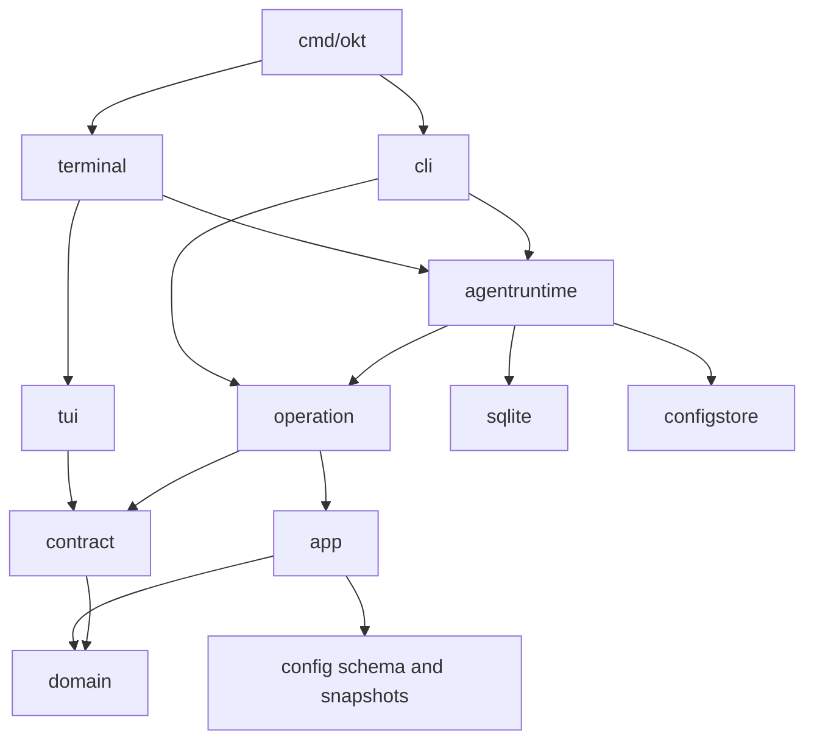

# Architecture

## Tech Stack

| Layer | Technology | Version |
|-------|-----------|---------|
| Language | Go | 1.25.8 (`go.mod` directive); 1.25.13 selected toolchain (`.mise.toml`) |
| CLI Framework | Cobra | v1.10.2 (`go.mod`) |
| TUI Framework | Bubble Tea | v1.3.10 (`go.mod`) |
| Terminal Styling | Lipgloss | v1.1.1-0.20250404203927-76690c660834 (`go.mod`) |
| ANSI helpers | `charmbracelet/x/ansi` | v0.11.6 (`go.mod`) |
| Database | SQLite (pure Go) | v1.50.0 — `modernc.org/sqlite` (`go.mod`) |
| YAML Parsing | `gopkg.in/yaml.v3` | v3.0.1 (`go.mod`) |
| Token Estimation | Standard-library word count | Built in |
| Build / Task runner | mise | `.mise.toml` |
| Linter | golangci-lint v2 | `.mise.toml`, `.golangci.yml` |
| Vuln Scanner | govulncheck | `.mise.toml` |

## Dependencies

| Dependency | Version | Purpose |
|-----------|---------|---------|
| `github.com/spf13/cobra` | v1.10.2 | CLI command tree, flags, help generation |
| `gopkg.in/yaml.v3` | v3.0.1 | YAML parsing/generation for config bundles + frontmatter |
| `modernc.org/sqlite` | v1.50.0 | Pure-Go SQLite driver (no CGo) |
| `github.com/charmbracelet/bubbletea` | v1.3.10 | TUI framework (Elm-like model/update/view) |
| `github.com/charmbracelet/bubbles` | v1.0.0 | TUI input/paginator primitives used by setup and forms |
| `github.com/charmbracelet/glamour` | v1.0.0 | Markdown rendering inside the TUI |
| `github.com/charmbracelet/lipgloss` | v1.1.1-0.20250404203927-76690c660834 | Terminal styling and layout |
| `github.com/charmbracelet/x/ansi` | v0.11.6 | ANSI escape utilities used by TUI rendering |
| `github.com/muesli/termenv` | v0.16.0 | Terminal color profile support via Charm stack |
| `github.com/pelletier/go-toml/v2` | v2.3.1 | TOML parsing for architecture checks on mise tasks |
| `github.com/google/uuid` | v1.6.0 | UUID generation (indirect, used by activity layer) |
| `github.com/dustin/go-humanize` | v1.0.1 | Human-readable formatting in TUI |
| `golang.org/x/term` | v0.43.0 | Terminal raw-mode + size detection (used by `internal/cli/setup_picker.go` during installer) |

## Dependency boundaries

The executable composes independent delivery adapters around application ports.
The domain imports no other internal package. Application services own business
rules; filesystem and database adapters implement their ports.

TUI code imports no CLI, operation implementation, runtime or storage adapter.
It receives `contract.Operations`, runtime views and narrow local ports.
`internal/terminal` binds those ports and starts Bubble Tea. CLI receives its
interactive runner from `cmd/okt` and imports no TUI. Operation and application
packages import no delivery adapters. `internal/arch/arch_test.go` verifies those
edges; `.golangci.yml` mirrors the production import restrictions.

## Package ownership

| Package | Responsibility |
|---|---|
| `cmd/okt` | Compose CLI and interactive runner; binary entry point |
| `internal/cli` | Cobra commands, flags, JSON envelopes and CLI interaction |
| `internal/terminal` | Bind TUI ports, notifications, project deletion and preview |
| `internal/tui` | Bubble Tea host, navigation, overlays and guarded async delivery |
| `internal/tui/screenhost` | Stable screen IDs, frames, descriptors and semantic outcomes |
| `internal/tui/screens` | Screen interaction and prepared presentation state |
| `internal/tui/components` | Shared layout, viewport, cursor and styling primitives |
| `internal/contract` | Operation DTOs and shared delivery/recovery ports |
| `internal/operation` | Surface-gated application operations and structured actions |
| `internal/app` | Business services and repository/configuration ports |
| `internal/app/guards` | Transition, operation and permission guard evaluation |
| `internal/domain` | Entities, errors, immutable event metadata and slug policy |
| `internal/agentruntime` | Shared bootstrap, per-project runtime cache and resource lifecycle |
| `internal/workfile` | Bounded UTF-8 OKF Markdown codec; preserves producer metadata |
| `internal/sqlite` | Operational persistence, transactional writes and live database snapshots |
| `internal/config` | Bundle schema, coherent loading, validation and immutable snapshots |
| `internal/config/bundledraft` | Pure staged bundle editing through an editor port |
| `internal/configstore` | Config filesystem adapter and bounded entity reads |
| `internal/recovery` | Recovery images, directory leases and retention |
| `internal/updater` | Bounded release downloads and same-filesystem binary staging |
| `internal/releaseverify`, `internal/releasemeta` | Signed release policy, verification and manifests |
| `internal/commandcatalog` | Canonical prompt names, routing tiers and descriptors |
| `internal/processutil` | External binary and editor resolution |
| `internal/project`, `internal/paths` | Project selection and platform paths |
| `internal/events`, `internal/hooks`, `internal/activity` | Event dispatch, configured actions and contextual observability |
| `internal/*projection`, `internal/graph`, `internal/taskvalidation` | Shared semantic projections and validation without UI implementations |
| `internal/testfixtures`, `internal/testutil`, `screenfixture`, `screentest` | Existing fixture, gallery and test support |

## Runtime and configuration

CLI and headless startup share `agentruntime.Bootstrap`. `BundleCache` owns one
`ProjectRuntime` per project ID. The cache's single construction path creates the
snapshot, operation service, editor, registries and inactive hook engine.

Reload prepares a candidate, checks consumer acceptance, drains the previous
engine and publishes the new runtime. Rejection keeps the active entry intact;
a drain failure leaves the replacement unpublished. Close rejects new rebuilds
and drains every cached engine before closing the database. Project lookup,
configuration discovery and reload errors propagate to CLI callers.

Configuration lives in YAML and file-backed assets. `config.Snapshot` supplies
immutable project policy. Enum construction belongs to `config.BuildEnumRegistry`;
slug normalization belongs to `domain.Slugify`. Event definitions become an
immutable `domain.EventRegistry` per project instead of a mutable process global.
The SQLite adapter prepares event category, summary, display and visibility
before delivery. Global log and metric queries preserve each project's metadata.
Event logging, broadcast, recent-row limits and automatic retention resolve the
origin project's policy. A local reload cannot replace another project's policy.
Store-wide orphan maintenance uses the default policy.

## Work documents

CLI reads and writes Markdown through `internal/workfile`. The operation facade
checks configured capabilities and project scope, then passes domain document
values to `app.WorkDocumentService` through `DocumentRepository`. Validation,
import orchestration and export projection have separate source files. The TUI
uses its independent contracts and ports.

Import reuses task, plan, tag and dependency services under one repository
transaction. SQLite binds queries and nested mutations to the transaction
context, buffers event publication, commits once and publishes durable events.
A failed import or preview rolls back every business mutation and its events.
Export hydrates the complete record under a consistent transaction snapshot.
File-local keys and producer extensions are persisted as entity-owned metadata;
export projects current business fields from their operational tables.

## Interactive behavior

`screen_registry.go` declares routes, placement, palette metadata, factories,
chrome and reload policy. The root stores a single base `screenhost.ID`, a detail
stack and history using those same IDs. Components own scroll and cursor state.
Screens receive business projections and emit semantic intents.

Notification actions contain an operation name and structured arguments. The
host injects project scope and dispatches through its action port. Cobra commands
and CLI output parsing do not participate in notification execution.

See [TUI screen assembly](tui-screen-assembly.md) for the normative presentation
rules. Existing screen recordings preserve interaction state and rendered output.
Removed guards and tests are not recreated to support this refactor.

## Destructive operations

Project deletion requires an atomic repository operation and a recovery lease.
The live SQLite connection writes the recovery image, including committed WAL
frames, before the cascade commits. One directory lease spans image creation,
mutation and retention. Standalone backups require an explicit snapshot writer;
there is no raw database-file copy fallback. Application template editing reads
sources through a bounded filesystem port.

## Verification and generated output

Run focused existing tests and `go test ./internal/arch/...` for structural
changes. `mise run test` instruments every project package so integration tests
count the adapters they exercise through ports. Its floor is 78.0%, without
package exemptions. `mise run lint` owns lint. The pre-push hook runs the complete
merge gate; it is configured with `core.hooksPath=scripts/hooks`.

Generated binaries, coverage, profiling and scratch output belong under `.tmp/`.
Persistent development configuration and databases belong under `dev_env/`.
Tool versions and task definitions come from `.mise.toml`; live dependency
versions come from `go.mod`. Do not maintain stale source or coverage counts in
this guide.

## Related guides

- [Developer guide](dev-guide.md)
- [Requirements](requirements.md)
- [Data model](data-model.md)
- [Configuration scope](../configuration-guide/project-overrides.md)
