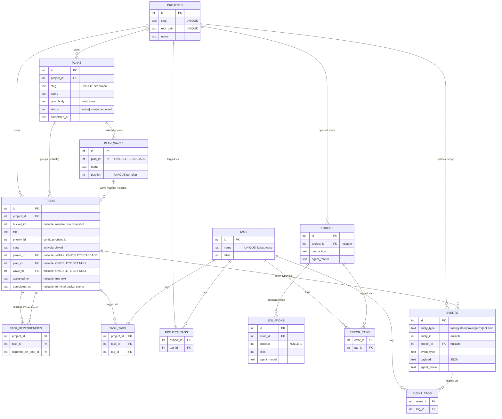

# Data Model Guide

Omakiten persists state in a single SQLite file (default `~/.local/share/omakiten/omakiten.db`, pure-Go driver `modernc.org/sqlite`). The schema is owned by the migration files under `migrations/` and applied transactionally on every connect (`internal/sqlite/store.go:Open`).

> **CQRS-like split — post Phase 2-bis.** YAML files (the active profile yaml plus per-entity markdown) are the **only** source of truth for config. SQLite is **operational data only** — tasks, comments, dependencies, tags, errors, solutions, plans, plan_waves, task assignment, and the unified events log. Migration 020 dropped every config table from the database; the runtime now resolves workflows, buckets, personas, skills, laws, and templates from an in-memory `config.Snapshot` rebuilt on every `ConfigService.Import` (see `.docs/configuration-guide/README.md` § In-memory providers).

## Migrations

Schema versions are tracked in `schema_migrations(version)`. Each numbered file under `migrations/` is applied once, in order. See the header comment of each SQL file for the full rationale; the table below is the index.

| File | What it adds |
|---|---|
| `001_initial.sql` | Core tables: `projects`, `config_bundles`, `settings`, `skills`, `personas`, `persona_skills`, `laws`, `workflows`, `workflow_buckets`, `workflow_transitions`, `tasks`, `comments`, `task_dependencies`, plus the original context-entry table (dropped in 033). |
| `002_entities.sql` | Adds `description` / `body` / `source_path` to entity tables; law `scope` (`global`/`project`/`persona`); `tasks.workdir` / `tasks.branch` (removed in 017). |
| `003_activity_logs.sql` | `activity_logs` table (later absorbed into `events`). |
| `004_tags.sql` | `tags`, `task_tags`, `project_tags`. |
| `005_transition_guards.sql` | `workflow_transitions.guards_json` (dropped with the table in 020). |
| `006_comment_tags.sql` | `comment_tags` (later absorbed into `event_tags`). |
| `007_errors.sql` | `errors`, `solutions`, `error_tags` — intentionally **cross-project**. |
| `008_solution_likes.sql` | `solutions.likes` counter, incremented by `solutions.confirm(success=true)`. |
| `009_events.sql` | Unified `events` table; migrates `comments` and `activity_logs` into it; rekeys `comment_tags` as `event_tags`; **drops** `comments`, `comment_tags`, `activity_logs`. |
| `010_agent_attribution.sql` | Adds `agent_model`, `agent_session_id` to `events` / `errors` / `solutions`; `source` / `entrypoint` to `errors` / `solutions`; `idx_events_agent_type` for per-model benchmark queries. Domain-event timeline starts here — pre-existing rows not backfilled. |
| `011_purge_tui_summary_pollution.sql` | One-shot delete of legacy `operation` rows written by the TUI Stats tick before `activity.WithoutTracking` wrapped the refresh context. |
| `012_task_state.sql` | Adds `tasks.state` (`active`/`archived`) and `idx_tasks_project_state`. Archive bypasses bucket policy / transition guards but still respects `operations.archive.guards`. |
| `013_bucket_permissions_operations.sql` | `workflow_buckets.permissions_json`, `workflows.operations_json` (both dropped in 020 — policy is now YAML-only). |
| `014_workflow_defaults.sql` | `workflows.defaults_json` (dropped in 020). |
| `015_priority_id.sql` | Converts `tasks.priority` (TEXT enum) into `tasks.priority_id` (INTEGER → `config.priorities`). Backfill: `1=low`, `2=normal`, `3=high`; YAML label renames never rewrite stored ids. |
| `016_severity_id.sql` | Same shape as 015 for `laws.severity` → `laws.severity_id` (`1=info`, `2=warning`, `3=error`). `laws` itself dropped in 020; severity id now read from frontmatter at import. |
| `017_drop_priority_severity_defaults.sql` | Drops the `DEFAULT 2` clauses on `priority_id` / `severity_id` (canonical default lives in `defaults/config/omakase.yaml`) and the unused `tasks.workdir` / `tasks.branch` columns. |
| `018_drop_legacy_event_payloads.sql` | Deletes pre-refactor task lifecycle rows so readers don't have to accept the old label-string payload shape. |
| `019_unify_tool_call_events.sql` | Renames `event_type='operation'` rows to `cli.tool_call` / `mcp.tool_call` / `tui.tool_call` (per `source`). Enriches `payload` so hooks match without SQL column reads. Legacy `operation` columns stay populated for the `metrics.summary` index. |
| `020_drop_config_tables.sql` | **Phase 2-bis breaking migration.** Drops `config_bundles`, `settings`, `skills`, `personas`, `persona_skills`, `laws`, `workflows`, `workflow_buckets`, `workflow_transitions`. First rewrites `tasks.bucket_id` from the SQL PK to the YAML-declared `local_id` so tasks still resolve. Rebuilds `tasks` to drop the bucket FK. |
| `021_rebind_orphan_buckets.sql` | Pure-SQL recovery for DBs that applied an earlier 020 missing the bucket rebind. Walks `events` per task to recover the bucket key; unrecoverable tasks land in bucket id 1. Idempotent. |
| `022_search_index.sql` | Creates FTS5 virtual table `search_index` (tokenizer `porter unicode61`) over tasks, comments, errors, solutions, context entries. Triggers keep it in sync. Backs the unified `search` MCP tool. |
| `023_plans.sql` | WBS-style plan catalog: `plans`, `plan_waves` (`ON DELETE CASCADE` on `plan_id`), plus nullable `plan_id` / `wave_id` / `assigned_to` on `tasks` (both FKs `ON DELETE SET NULL`). Adds `idx_tasks_plan_wave`. Deleting a plan cascades waves but only nulls task pointers. |
| `024_search_index_plans.sql` | Extends the FTS5 `search_index` with `plan` rows (`name + ' ' + goal_body`). |
| `025_projects_cascade.sql` | Rebuilds project-owned tables so deleting a project cascades through tasks, context entries, project-scoped errors, plans, dependencies. Events keep a bare `project_id`; the service deletes project-scoped event rows explicitly. |
| `026_tasks_parent_id.sql` | Nullable `tasks.parent_id` (`ON DELETE CASCADE`) + `idx_tasks_parent_id` for sub-task trees. |
| `027_tasks_parent_project_fk.sql` | `BEFORE INSERT` / `BEFORE UPDATE` triggers rejecting cross-project parents — closes the gap left by the single-column self-FK. |
| `028_tasks_depth.sql` | Materialized `tasks.depth` column for sub-task trees. |
| `029_repair_tasks_depth.sql` | Repairs `tasks.depth` drift and installs an invariant trigger. |
| `030_rename_errors_researched.sql` | Renames historical `error.searched` rows to `errors.researched` (event-registry refactor). |
| `031_notes.sql` | **Never shipped.** Added a standalone `notes` entity (`notes`, `notes_tags`, `notes_fts`, plus `entity_type='note'` search-index triggers). Superseded and fully dropped by 032 before any release. |
| `032_events_comment_log.sql` | Makes `events` the scoped comment log. Adds `kind` / `title` / `pinned` / `updated_at` columns to `events`, recasts comment scope onto `(entity_type, entity_id, project_id)` — `task`+taskID, `project`+projectID, `universal`+NULL — and **drops the unreleased `notes` entity** (table, join, FTS, triggers; zero rows, no data migration). Recasts the comment `search_index` triggers to index `body + ' ' + title`. |
| `033_drop_context_entries.sql` | **Drops the context-entry table** and retires its search path. The Go service/store/domain layer was already removed upstream; this migration drops the `'context'` `search_index` mirror triggers and rows, then drops the table. Hard drop — any existing rows are discarded (no backfill). Handoff state now lives in project-scoped comments and `progress.record`. |

## Current schema (post-033)

The live schema contains thirteen base tables of operational state plus `schema_migrations` and the `search_index` FTS5 virtual table:

```text
schema_migrations      project_tags
projects               error_tags
tasks                  event_tags
task_dependencies      events
errors                 plans
solutions              plan_waves
tags                   search_index (FTS5 virtual)
task_tags
```

The diagram below reflects that shape. Crow's-foot reads as: `||--o{` is one-to-many; pure-junction tables (`*_tags`, `task_dependencies`) sit between the two entities they link.



A few invariants the diagram cannot express compactly:

- **Project-scope invariant** for tasks: `tasks(project_id, id)` is a composite unique key, and `task_dependencies` uses dual composite FKs into it — this is what guarantees a dependency can never cross projects. Sub-task `parent_id` uses a self-FK for existence plus migration-027 triggers for same-project enforcement.
- **Cycle prevention** for `task_dependencies` is enforced in software (`internal/graph/dependency.go:HasCycle`), not by the schema.
- **`tasks.bucket_id`** is an unconstrained `INTEGER` post-020 — there is no FK to a buckets table because no buckets table exists. The application resolves it against the per-project `config.Snapshot.BucketByID` built from YAML on every bundle import. An id Snapshot cannot resolve marks the row as an **orphan** and surfaces through `app.OrphanRepository.PreviewOrphanedTasks` / `RebindOrphanedTasks` (see `.docs/configuration-guide/README.md` § Orphan-task migration).
- **`tasks.priority_id`** is similarly unconstrained at the SQL layer. Validation is the bundle validator's job: every `priority_id` written must match an entry in `config.priorities`. Renaming a priority label is a YAML edit; the integer id stored on tasks does not change.
- **`events` is a discriminated log**: `(entity_type, event_type)` selects the row's role (see "The unified events table" below). `entity_id` is the task / error / solution id when the entity type names a row, and is `NULL` for `entity_type='system'`.
- **`solutions.success`** is a tri-state (`NULL` = untried, `0` = known-bad, `1` = known-good); `1` is the only state that increments `likes`.

## Tables

### `projects`

`id INT PK`, `name`, `slug UNIQUE`, `root_path UNIQUE`, `created_at`, `updated_at`, `archived_at?`.

The active project is resolved by id, slug, or by matching `root_path` to the current working directory (`internal/project/resolver.go`). A repo-local `.omakiten/` directory affects config resolution only; the SQLite database remains in the resolved data root (`$OMAKITEN_HOME/data`, `$XDG_DATA_HOME/omakiten`, or `~/.local/share/omakiten`).

### `tasks`

Post-027 column shape:

```sql
id           INTEGER PRIMARY KEY AUTOINCREMENT
project_id   INTEGER NOT NULL REFERENCES projects(id)
bucket_id    INTEGER                     -- no FK; resolved via Snapshot
title        TEXT    NOT NULL
description  TEXT    NOT NULL DEFAULT ''
priority_id  INTEGER NOT NULL            -- references config.priorities[*].id
state        TEXT    NOT NULL DEFAULT 'active'
                     CHECK (state IN ('active','archived'))
created_at   TEXT    NOT NULL DEFAULT CURRENT_TIMESTAMP
updated_at   TEXT    NOT NULL DEFAULT CURRENT_TIMESTAMP
completed_at TEXT                        -- stamped on transition INTO terminal bucket;
                                           -- cleared on transition OUT
parent_id    INTEGER REFERENCES tasks(id) ON DELETE CASCADE
                                          -- nullable sub-task parent; triggers enforce
                                          -- parent.project_id == child.project_id
plan_id      INTEGER REFERENCES plans(id) ON DELETE SET NULL
wave_id      INTEGER REFERENCES plan_waves(id) ON DELETE SET NULL
assigned_to  TEXT                        -- free-text claimant; populated by
                                          -- plans.claim_next or okt assign.
                                          -- plans.claim_next publishes task.assigned
                                          -- post-commit since 5b25db6 (2026-05-24);
                                          -- the row landed on disk pre-fix but the
                                          -- bus stayed silent.
UNIQUE(project_id, id)
```

The `UNIQUE(project_id, id)` shape is what lets `task_dependencies` use a composite foreign key to enforce that **dependencies cannot cross projects**.

`parent_id` forms a same-table hierarchy for sub-tasks. The self-FK guarantees the parent exists; the `tasks_parent_project_insert_guard` and `tasks_parent_project_update_guard` triggers added in migration 027 guarantee the parent belongs to the same project as the child. Deleting a parent cascades through its sub-tree at the database layer.

`completed_at` is populated by `WorkflowService.MoveTask` whenever the destination is the workflow's final bucket and cleared when a task leaves the terminal bucket. Existing historical `done` rows are backfilled to `updated_at` once per `BuildProjectRuntime` via `Store.BackfillTaskCompletedAt` (`internal/sqlite/tasks_lifecycle.go`); the backfill is idempotent (zero rows after the first run) and errors are swallowed so a transient SQLite hiccup cannot block runtime composition. Tasks that bounced in/out of `done` lose the original completion moment — best-effort by design.

`plan_id` / `wave_id` / `assigned_to` are NULL for every task created before migration 023 and for any task not attached to a plan. Behavior is identical to pre-023 across CLI, TUI, MCP, guards, and metrics for those rows; the `wave_gate` guard returns `0` (no-op pass) when `wave_id IS NULL`.

Indexes:

- `idx_tasks_project_bucket(project_id, bucket_id)` — feeds bucket-filtered list views (board, table).
- `idx_tasks_project_state(project_id, state)` — feeds the archived-tasks toggle (`TaskFilter.IncludeArchived`).
- `idx_tasks_plan_wave(plan_id, wave_id)` — feeds plan/wave projections (`PlanService.Show`, network diagram).

### `plans`

```sql
id           INTEGER PRIMARY KEY AUTOINCREMENT
project_id   INTEGER NOT NULL REFERENCES projects(id)
slug         TEXT    NOT NULL
name         TEXT    NOT NULL
goal_body    TEXT    NOT NULL DEFAULT ''  -- markdown goal + acceptance criteria
status       TEXT    NOT NULL DEFAULT 'active'
                     CHECK (status IN ('active','done','abandoned'))
created_at   TEXT    NOT NULL DEFAULT CURRENT_TIMESTAMP
updated_at   TEXT    NOT NULL DEFAULT CURRENT_TIMESTAMP
completed_at TEXT
UNIQUE(project_id, slug)
```

A plan groups child tasks into ordered waves. v1 is **single-project** by design (`project_id NOT NULL`); cross-project plans are a deliberate follow-up (`plan_projects(plan_id, project_id)` junction would replace the direct FK). Plan status auto-transitions to `done` when the last child task closes — there is no separate `requirements` entity; optional human-authored acceptance criteria live in `goal_body`.

`plans.goal_body` is mirrored into the FTS5 `search_index` virtual table (entity_type `plan`, content = `name + ' ' + goal_body`) via migration 024 so cross-project `search` finds plan goals.

### `plan_waves`

```sql
id       INTEGER PRIMARY KEY AUTOINCREMENT
plan_id  INTEGER NOT NULL REFERENCES plans(id) ON DELETE CASCADE
name     TEXT    NOT NULL
position INTEGER NOT NULL
UNIQUE(plan_id, position)
```

Waves are ordered phases inside a plan. Tasks within a wave run in parallel; wave `N+1` is gated on wave `N` being fully closed via the `wave_gate` guard (see `.docs/configuration-guide/guards.md`) — gating is **not** modelled as auto-wired dependency edges so the network diagram stays clean and the edge count stays linear instead of N×M.

`ON DELETE CASCADE` on `plan_id` ensures waves disappear with their plan; child tasks keep `state='active'` because `tasks.plan_id` / `tasks.wave_id` are `ON DELETE SET NULL` (deleting a plan never deletes its work, only detaches it).

### `task_dependencies`

`(project_id, task_id, depends_on_task_id)` PK, with `CHECK (task_id != depends_on_task_id)` and dual FKs into `tasks(project_id, id)`. The `app.DependencyService` adds cycle detection in software (`internal/graph/dependency.go:HasCycle`) since SQLite cannot enforce DAG-ness.

### `tags`

`id`, `name UNIQUE` (kebab-case-normalized via `app.NormalizeTagName`), `label`, `created_at`.

Four join tables attach tags:

| Join | Reference | Scope |
|---|---|---|
| `task_tags` | `(project_id, task_id, tag_id)` | task ↔ tag |
| `project_tags` | `(project_id, tag_id)` | project ↔ tag |
| `error_tags` | `(error_id, tag_id)` | error ↔ tag (cross-project) |
| `event_tags` | `(event_id, tag_id)` | event ↔ tag — used to tag comments (which are events) |

`tags.merge` reassigns rows from one tag id to another and deletes the source. Orphan tag cleanup is exposed via `TagRepository.DeleteOrphanTags`.

### `errors`, `solutions`, `error_tags`

```text
errors:    id, description, context, project_id?, created_at,
           source, entrypoint, agent_model, agent_session_id?
solutions: id, error_id (FK), description, steps,
           success NULL|0|1, task_id?, tried_at?, created_at, likes,
           source, entrypoint, agent_model, agent_session_id?
error_tags: error_id, tag_id          -- cascades on errors delete
```

**Cross-project by design.** Errors carry an optional `project_id` (so you can filter), but the unified `search` tool (with `entity_types=["error"]`) and `solutions.list_top` are global so prior fixes are reusable across projects (see `.docs/mcp.md` § Tools).

`solutions.success` is a tri-state:

- `NULL` — recorded but never tried.
- `0` — known-bad (the agent should not retry without new context).
- `1` — known-good — increments `solutions.likes` (`migration 008`).

The `source` / `entrypoint` / `agent_model` / `agent_session_id` columns (`migration 010`) denormalize the calling agent's identity from the `internal/activity` context at write time. They feed `metrics.summary` directly without a join. `agent_session_id` is nullable so absent sessions don't distort `GROUP BY` queries; `agent_model=""` marks non-agent traffic (TUI human, system internals) and is filtered out of per-model benchmarks.

Indexes: `idx_errors_project`, `idx_errors_created_at(DESC)`, `idx_solutions_error`, `idx_solutions_likes(DESC)`.

## The unified `events` table

After migration 009, **comments**, **task lifecycle events**, **operational telemetry**, and (after migration 010) **domain events** all live in one append-only log. The discriminators are `entity_type` and `event_type`. Since migration 032 the `events` table also carries the note-like comment columns `kind` / `title` / `pinned` / `updated_at`, and comment **scope** is encoded in `(entity_type, entity_id)`: `task`+task id, `project`+project id, `universal`+NULL. There is no separate notes entity — a "note" is just a project/universal-scoped comment (see [`migrations/032_events_comment_log.sql`](../../migrations/032_events_comment_log.sql)).

| `entity_type` | `event_type` | `entity_id` | Use |
|---|---|---|---|
| `task`/`project`/`universal` | `comment` | task id / project id / NULL | Comment authored by a human or agent, scoped via `entity_type`. `body` carries the text; `author_type` is `'human'`/`'agent'`; optional `kind` (free string, e.g. `handoff`/`recap`/`standup`), `title`, and `pinned` flag. Indexed in `search_index` as `body + ' ' + title`. |
| `task`/`project`/`universal` | `comment.edited` | comment's scope id | Comment patched (body/title/kind/pinned and/or tags). `updated_at` is bumped. Payload always carries `comment_id`; `body:{from,to}` is included only when the body actually changed (metadata-only edits emit just `{comment_id}`). Emitted under the comment's own scope. |
| `task`/`project`/`universal` | `comment.removed` | comment's scope id | Comment hard-deleted (scope-agnostic). `payload={comment_id, author_type, body}`. Emitted under the comment's own scope. |
| `task` | `task.created` | task id | Emitted in the same transaction as the `tasks` insert. `payload={bucket}`. |
| `task` | `task.moved` | task id | Emitted by the task repo when `bucket_id` changes via a transition. `payload={from, to}`. |
| `task` | `task.migrated` | task id | Emitted when a task is rebound by a workflow swap (preset change, bucket removed/renamed). Distinct from `task.moved` because transition guards are bypassed. `payload={from, to, reason:"workflow_swap"}`. |
| `task` | `task.completed` | task id | Emitted by `app.WorkflowService.MoveTask` when the destination bucket is the workflow's final bucket. `payload={bucket}`. |
| `task` | `task.edited` | task id | Mutable fields changed. `payload={title?:{from,to}, description?:{from,to}, priority?:{from,to}}` — only keys for fields that actually changed are present; `priority.from`/`priority.to` are the integer priority ids. |
| `system` | `task.removed` | task id | Task hard-deleted. Emitted on the surviving `system` entity row (the task row is gone by then). `payload={task_id, title, description, priority, bucket_key, state}`. |
| `task` | `task.archived` | task id | Task moved to `state='archived'`. `payload={from_bucket, to_bucket, from_state, to_state}` — bucket transitions to the workflow's final bucket atomically with the state flip. |
| `task` | `task.unarchived` | task id | Previously-archived task restored to `active`. `payload={from_bucket, to_bucket, from_state, to_state}` — bucket stays where the task currently sits. |
| `task`/`project`/`error` | `tag.added` / `tag.removed` | entity id | Tag attached/detached. `payload={entity_type, entity_id, tag_id, tag_name}`. |
| `task` | `dependency.added` / `dependency.removed` | dependent task id | Dependency edge insert/delete. `payload={depends_on_task_id}`. |
| `task`/`comment` | `guard.violated` | task/comment id per `payload.target` | Any operation rejected by a configured guard. `payload={operation, rule, hint, target, attempted_by}` — `operation` and `rule` are free-form strings supplied by the call site. |
| `system` | `cli.tool_call` / `mcp.tool_call` / `tui.tool_call` | (null) | Per-call activity log entry written by `activity.Track`. `payload={tool_name, source, entrypoint, status, duration_ms, error_message, args}` mirrors the operation columns so hooks can filter without reading SQL columns. Source-discriminated since migration 019; the legacy `operation` event_type is deprecated and no longer emitted. |
| `system` | `hook.executed` | (null) | Hook action finished (success or failure). `payload={hook_index, action, event_type, target_event_id, success, error, duration_ms}`. |
| `system` | `bundle.swapped` | (null) | Active config bundle replaced via the TUI hot-reload path. `payload={from_workflow, to_workflow, orphan_count, groups}`. |
| `system` | `bundle.imported` | (null) | A fresh bundle reached the runtime (source-of-truth flipped). `payload={path, hash, workflow_key, workflow_count, persona_count, skill_count, law_count, template_count}`. |
| `system` | `confirmation.granted` | (null) | TUI dispatched a non-empty `NotificationAction.Command` in response to a user keystroke. `payload={notification_slug, action_id, command}`. |
| `error` | `error.recorded` | error id | `app.ErrorService.Record` persisted a new error row. `payload={tags, has_context}`. |
| `search` | `errors.researched` | (null) | `app.SearchService.Search` ran (unified FTS5 across tasks / comments / errors / solutions / plans). `payload={query, entity_types, result_count, unified}`. |
| `solution` | `solution.added` | solution id | `app.ErrorService.AddSolution` persisted a candidate. `payload={error_id}`. |
| `solution` | `solution.confirmed` | solution id | `ConfirmSolution` ran (regardless of outcome). Co-emits with `solution.liked` or `solution.failed`. `payload={error_id, success, likes}`. |
| `solution` | `solution.liked` | solution id | `ConfirmSolution(success=true)`. `payload={error_id, likes}`. |
| `solution` | `solution.failed` | solution id | `ConfirmSolution(success=false)`. `payload={error_id, likes}`. |
| `solution` | `solution.viewed_top` | (null) | `ListTopSolutions` ran. `payload={limit, returned_count}`. |
| `project` | `project.updated` | project id | `agent.Service.EditProject` rewrote a project's mutable metadata (today only the `description` column, whose write path was restored after living schema-only since migration 002). `payload={description:{from,to}}`. Emitted only when the value actually changed; a no-op edit writes nothing. |

The canonical event-type vocabulary is the `EventType*` constants in `internal/domain/event.go`; the closed set lives in `domain.KnownEventTypes` (consumed by config validation to reject hook overrides referencing typos). `agent_model` and `agent_session_id` are populated from the request context on every domain event (and on every `*.tool_call` row). `metrics.summary` aggregates these rows by `agent_model` to benchmark agent behaviour.

The `events` row carries every column it might need; unused columns are nullable. Three indexes:

- `idx_events_entity(entity_type, entity_id, created_at)` — feeds the per-task activity feed (`task_activity.list` MCP tool, the TUI's activity column, `internal/sqlite/events.go:ListTaskActivity`).
- `idx_events_type_started(event_type, created_at)` — feeds the unified logs view (`internal/sqlite/events.go:ListEvents`) and the synchronous tool-call pruner.
- `idx_events_agent_type(agent_model, event_type, created_at)` — feeds the `metrics.summary` aggregation queries (`internal/sqlite/metrics.go:AgentMetricsSummary`).

### Pruning policy (`*.tool_call` only)

After every successful `*.tool_call` insert, those rows are pruned synchronously by `internal/sqlite/activity_logs.go:PruneActivityLogs`. Both knobs come from the user's bundle (`config.activity_log.max_rows`, `config.activity_log.max_age_days`) and are wired into the `Store` at composition-root time via `Store.SetActivityLogRetention`. The kit canonical (`defaults/config/omakase.yaml`) ships:

- **Max age**: 7 days (`config.activity_log.max_age_days`).
- **Max rows**: 500 most-recent (`config.activity_log.max_rows`).

Both fields are validator-required (> 0) — disabling retention is not a supported mode.

**Comments, task lifecycle, domain, and system events are not pruned** — they are durable history. Pruning is scoped to the tool-call entries.

### Reader / writer cheat-sheet

| Surface | What it sees | File |
|---|---|---|
| `comments.list` default (CLI/MCP/TUI) | `entity_type='task' AND event_type='comment'` ordered ascending by id | `internal/sqlite/comments.go:ListComments` |
| `comments.list` filtered (scope/kind/tag/pinned/query/since/comment_id) | `event_type='comment'` with scope, kind, pinned, tag-join, FTS5 (`search_index`), and `created_at` floor predicates layered on | `internal/sqlite/comments.go:QueryComments` |
| `task_activity.list` MCP tool, TUI activity column | `entity_type='task'` ordered chronologically (asc default, desc optional) | `internal/sqlite/events.go:ListTaskActivity` |
| Logs view (TUI), `okt logs`, `logs.list` | Unified `EventRow` projection over the selected category/window, ordered by created time, with `domain.SummarizeEvent` supplying the display detail | `internal/sqlite/events.go:ListEvents` |
| Guard `comments_min` | `count(*) WHERE entity_type='task' AND event_type='comment' AND entity_id=?` | `internal/sqlite/guards.go:CountTaskComments` |
| Guard `comments_tagged` | join `events` ⨝ `event_tags` ⨝ `tags` filtered by tag name | `internal/sqlite/guards.go:CountTaskCommentsTagged` |
| `metrics.summary` | `events` grouped by `agent_model`, `event_type`, filtered on the agent-type index | `internal/sqlite/metrics.go:AgentMetricsSummary` |

## Bucket and priority resolution

`tasks.bucket_id` and `tasks.priority_id` are integer references into per-project YAML data, not SQL FKs.

- **Bucket id → bucket key**: `config.Snapshot.BucketByID(id)` (`internal/config/snapshot.go`). The Snapshot is rebuilt from `config.Bundle.Workflows[*].Buckets[*]` on every `ConfigService.Import` (or hot-reload via `Repositories.Cache.Reload`). The bucket's stable id is the YAML-declared `local_id` (the canonical ids `1=backlog`, `2=dev`, `3=review`, `4=done` for `omakase`; other presets carry their own).
- **Priority id → priority label**: resolved through the `*domain.EnumRegistry` returned by `ConfigService.Import` and injected into every service that needs labels (`TaskService`, `WorkflowService`, `TUIQueryService`, agent `Service`). The on-the-wire JSON shape is the raw int id — label projection happens at the DTO boundary so different surfaces (TUI, CLI table, MCP DTO) can resolve to different shapes if they want.

A task pointing at a `bucket_id` the active Snapshot cannot resolve is an **orphan**. Orphans surface through `app.OrphanRepository`:

- `PreviewOrphanedTasks` — read-only count + per-task preview (used by the TUI hot-reload prompt when the project has no sub-task kit configured).
- `RebindOrphanedTasks` — in-tx rebind to the same key in the new workflow (preserved) or to the first active bucket (removed), emitting `task.migrated` per task.
- `PreviewOrphanedCascade` — sub-task-kit-aware preview keyed on a `domain.OrphanCascadePlan` (root + sub resolver pairs + kit identities). Routes root-tree rows through the root snapshot, sub-task rows through the sub-kit snapshot, and returns the combined report.
- `RebindOrphanedCascade` — atomic counterpart to `PreviewOrphanedCascade`. Opens **one** transaction in the adapter and runs the root rebind + the sub-task rebind inside it; a sub-task failure rolls back the root-pass writes too. Events from both passes buffer until commit, so subscribers never observe a partial migration. `OrphanService.Preview` / `Migrate` route through the cascade entry points whenever either snapshot in the pair declares a sub-task kit; pre-cascade projects keep using `PreviewOrphanedTasks` / `RebindOrphanedTasks` byte-for-byte. The plan struct lives in `internal/domain/orphan_cascade.go`.

The same rebind primitives are reached from the CLI (`okt workflow orphans --confirm`) and the MCP (`orphans.migrate` tool, two-phase confirmation) — `internal/sqlite/orphans.go`, `internal/app/orphan_service.go`, `internal/cli/workflow.go`, `internal/agent/service_orphan.go`.

## Project-scope invariant

Every operational query filters by `project_id` at the SQL layer. This is the canonical enforcement point of NFR-007 ("operational data is strictly project-scoped"); the agent layer adds defense-in-depth on top by always materializing a single `ProjectContext` at intent entry (`internal/agent/service.go`).

The cross-project exceptions (errors, solutions, global tag list, template catalog) are explicitly scoped that way in their service methods — they never touch the project filter.

## Connection settings

`internal/sqlite/store.go:Open` configures every connection with:

- `PRAGMA foreign_keys = ON;` — required for the dependency / events / tags FK cascades to fire.
- A busy-timeout to ride through brief contention.

The driver is pure Go (`modernc.org/sqlite`), so the binary builds without CGo.

## Transactional event emission

Every storage mutation that also writes the `events` log goes through `txMutateAndEmit[T]` (`internal/sqlite/txevent.go:100`), which owns the canonical `BeginTx → mutate → emit → Commit → publish` lifecycle. Callers describe one cycle by populating a `TxMutation[T]` literal (`internal/sqlite/txevent.go:41`): `Scope` picks `insertEntityEvent` vs `insertTaskEvent`, `Mutate` runs the persistence write inside the helper's transaction, `Payload` builds the JSON column after the mutation has produced the post-`RETURNING` row, `EntityID` / `Body` derive event columns from the same value, and `ShouldLog` optionally gates the row insert (synthetic broadcast still fires).

Representative callsites:

- `internal/sqlite/plans.go:29` — `CreatePlan` (entity scope, `plan.created`).
- `internal/sqlite/plans.go:124` — `UpdatePlanGoalBody` (entity scope, `plan.goal_edited`).
- `internal/sqlite/plans.go:298` — `AddPlanWave` (entity scope, `plan.wave_added`).
- `internal/sqlite/plans.go:727` — `ClaimNextPlanTask` (task scope, `task.assigned`).
- `internal/sqlite/tasks.go:40` — `CreateTask` (task scope, `task.created`, gated via `shouldLogEvent`).

The scoped comment writers (`AddScopedComment`, `EditComment`, `DeleteComment` in `internal/sqlite/comments.go`) hand-roll their own `BeginTx → mutate → emit → Commit → publish` cycle rather than going through `txMutateAndEmit`, because they resolve the event's entity scope (`entityIDForScope`) and gate the row insert per scope themselves. They preserve the same invariants (event row shares the mutation's transaction; `publishEvent` only after commit; `shouldLogEvent` gating with a synthetic broadcast when off).

The invariant the helper enforces: the mutation row and the events row land in the same SQL transaction, so a rollback drops both. `tx.Commit()` is the only path to a `publishEvent` call, so bus subscribers never observe an event whose underlying row failed to persist; a `Payload` error after a successful `Mutate` rolls the mutation back rather than emitting an event with a malformed JSON column. `ShouldLog=false` skips the row insert but still publishes a synthetic `domain.Event` post-commit so listeners that previously read from the inline gated callsites (CreateTask, MoveTask, SetTaskState, RebindOrphanedTasks) keep their existing wire shape.

## `sqlutil` helpers

The adapters under `internal/sqlite/` share a small, dependency-free helper package at `internal/sqlite/sqlutil/` for patterns that were drifting between callsites:

- `NullStringOr(v, fallback)` (`internal/sqlite/sqlutil/null.go:30`) — coerces a `sql.NullString` to a plain string with an explicit fallback. Use when the domain field is a non-nullable string and the column is nullable for storage reasons. Sibling helpers `NullInt64Ptr` and `NullTimePtr` lift nullable columns into typed pointers when the domain distinguishes "absent" from zero.
- `ScanRow[T]` (`internal/sqlite/sqlutil/scan.go:21`) — runs a decode closure against a single `Scanner` so the `QueryRowContext` path and the `QueryContext`/`ScanAll` path share one column list. Use whenever both single-row and multi-row variants exist (the historical `scanFoo` / `scanFooRows` pair).
- `MapSQLiteError(err)` (`internal/sqlite/sqlutil/constraint.go:85`) — classifies `modernc.org/sqlite` driver errors into a typed `*ConstraintError` (`internal/sqlite/sqlutil/constraint.go:55`) carrying `Violation` (unique / foreign_key / check / not_null), best-effort `Table` / `Field`, and the original cause via `Unwrap`. Use at the storage edge to translate raw driver errors into domain errors via `errors.As(mapped, &ce)` (see `internal/sqlite/plans.go:43`).

Helpers in `sqlutil` are behaviour-equivalent extractions, not new policy — adding a new fallback rule (e.g. "treat empty string as NULL") belongs in the caller, not the helper.

## Schema auto-migration (config side)

`MigrateLayout` (in `internal/config/migration.go`) runs every time
the CLI / TUI boots through the materialize path and is responsible
for two distinct migration surfaces:

1. **Directory shape** (v0 / v1 / v2 layouts). Documented inline at
   the function's godoc; the v2 shape is the current source of truth.
2. **YAML schema** (`migrateSchemaDefaults` in
   `internal/config/migration_schema.go`). Backfills required keys
   that were added in later releases so user bundles authored before
   those releases survive the next launch without manual edits. The
   helper walks every `<root>/config/*.yaml`, parses to a
   `*yaml.Node` (so user comments + key order survive), and only
   rewrites a profile when at least one of the required keys is
   missing. Identical inputs read through to a byte-identical write
   that is skipped — running it twice is a no-op.

Currently backfilled:

- `config.sqlite.cache_size_kb` (kit canonical: 1024) — required since
  W7 #225.
- `config.sqlite.mmap_size_bytes` (kit canonical: 0) — required since
  W7 #225.

When adding a new required key to the wiring schema, extend
`migrateSchemaDefaultsInFile` with a `mapValueNode(... ) == nil`
check + `appendMapEntry(...)` call rather than letting the validator
break user bundles on upgrade. The pattern keeps every prior version
of the wiring loadable as long as the kit canonical for the new key
is sensible as a backfill default.

### Config loaders: `LoadFromDir`

The per-entity packs (skills, laws, personas, templates, language packs, notifications) all reach disk through one generic walker, `LoadFromDir[T]` (`internal/config/loadfromdir.go:81`). It walks `dir/` then `dir/custom/` for files matching `LoadOptions[T].Suffixes`, reads each under `MaxFileBytes`, invokes the caller's `Decode` to produce a `T`, dedups by `SlugOf`, and returns items in alphabetical slug order. A missing `dir` returns `(nil, nil, nil)` so first-run paths can call it before any defaults are materialised. `OnDecodeError` lets custom-scope files degrade to a warning + skip while default-scope drift stays fatal (used by `internal/config/notification_loader.go:49`).

`CollisionPolicy` (`internal/config/loadfromdir.go:18`) controls what happens when two files produce the same slug. Same-scope duplicates (two defaults, or two customs) are always an error; the policy only varies on the cross-scope edge:

- `CollideOverwrite` — defaults walked first, customs win on cross-scope collision. The behaviour every shipping loader uses today: `internal/config/entity_loader.go:44` (skills), `:77` (laws), `:114` (personas), `:155` (templates), `internal/config/language.go:59` (language packs), `internal/config/notification_loader.go:49` (notifications).
- `CollideError` — any duplicate slug is fatal regardless of scope. No current consumer; pinned by tests so a future loader can opt in.
- `CollideKeepFirst` — cross-scope keeps the first arrival (default wins, custom skipped). Reserved for read-only baselines where a custom file must never shadow the bundled default.

The typical layering: `defaults/` ships the kit canonical pack, the user drops overrides into `custom/`, and `LoadFromDir` merges them into a single slug-keyed catalog the `Snapshot` indexes by.

## Where to learn more

- Migration sources: `migrations/001_initial.sql` … `migrations/032_events_comment_log.sql`.
- Domain types behind every row: `internal/domain/` (`task.go`, `event.go`, `tag.go`, `error_record.go`, `context.go`, `priority_test.go`, `severity_test.go`).
- Adapter implementations: `internal/sqlite/` (one file per concern — `tasks.go`, `tasks_lifecycle.go` (archive/unarchive/remove), `comments.go`, `dependencies.go`, `events.go`, `tags.go`, `errors.go`, `metrics.go`, `bucket_resolver.go`, `activity_logs.go`, `guards.go`, `contexts.go`, `orphans.go`, `projects.go`, `store.go`).
- App-level ports the adapter satisfies: `internal/app/ports.go`.
- The in-memory side: `.docs/configuration-guide/README.md` § How config reads work at runtime; `internal/config/snapshot.go`, `internal/agentruntime/cache.go`.

## See also

- `architecture.md` — codebase shape.
- `internal/domain/event.go::KnownEventTypes` — events backed by these schemas.
- `../configuration-guide/README.md` — schema-level config knobs.
- `dev-guide.md` — local dev / migration commands.
