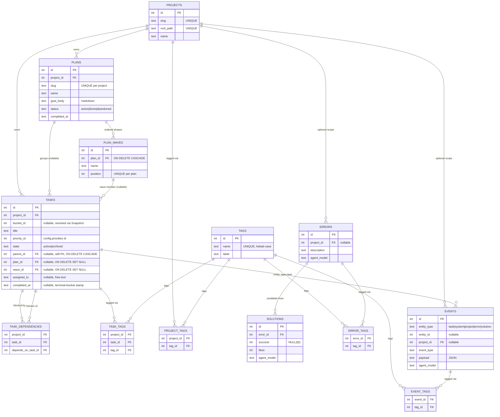

# Data Model Guide

Omakiten persists operational state in a single SQLite file (default
`~/.local/share/omakiten/omakiten.db`, pure-Go driver
`modernc.org/sqlite`). The schema is the embedded current baseline at
`internal/sqlite/schema.sql`. A missing database is initialized from that
baseline; an existing database must match it exactly or `Open` returns a
`validation_error` naming a new database path or current-compatible backup.
Filesystem-backed opens reject symlink path components and targets, and verify
the selected file identity before schema or WAL mutation.

> **Source-of-truth split.** YAML files (the active profile plus per-entity
> markdown) are the only source of truth for configuration. SQLite is
> operational data only: tasks, comments, dependencies, tags, errors,
> solutions, plans, plan waves, task assignment, and the unified events log.
> The runtime resolves workflows, buckets, personas, skills, laws, and
> templates from an immutable per-project `config.Snapshot` built at bundle
> import (see `.docs/configuration-guide/project-overrides.md`).

## Current schema

The live schema contains the operational tables below plus the `search_index`
FTS5 virtual table:

```text
projects               error_tags
tasks                  event_tags
task_dependencies      events
errors                 plans
solutions              plan_waves
tags                   search_index (FTS5 virtual)
task_tags
project_tags
```

The diagram below reflects that shape. Crow's-foot reads as: `||--o{` is one-to-many; pure-junction tables (`*_tags`, `task_dependencies`) sit between the two entities they link.


```mermaid
erDiagram
    PROJECTS {
        int  id PK
        text slug "UNIQUE"
        text root_path "UNIQUE"
        text name
    }
    TASKS {
        int  id PK
        int  project_id FK
        int  bucket_id "nullable, resolved via Snapshot"
        text title
        int  priority_id "config.priorities id"
        text state "active|archived"
        int  parent_id FK "nullable, self-FK, ON DELETE CASCADE"
        int  plan_id FK "nullable, ON DELETE SET NULL"
        int  wave_id FK "nullable, ON DELETE SET NULL"
        text assigned_to "nullable, free-text"
        text completed_at "nullable, terminal-bucket stamp"
    }
    PLANS {
        int  id PK
        int  project_id FK
        text slug "UNIQUE per project"
        text name
        text goal_body "markdown"
        text status "active|done|abandoned"
        text completed_at
    }
    PLAN_WAVES {
        int  id PK
        int  plan_id FK "ON DELETE CASCADE"
        text name
        int  position "UNIQUE per plan"
    }
    TASK_DEPENDENCIES {
        int project_id FK
        int task_id FK
        int depends_on_task_id FK
    }
    TAGS {
        int  id PK
        text name "UNIQUE, kebab-case"
        text label
    }
    TASK_TAGS {
        int project_id FK
        int task_id FK
        int tag_id FK
    }
    PROJECT_TAGS {
        int project_id FK
        int tag_id FK
    }
    ERRORS {
        int  id PK
        int  project_id FK "nullable"
        text description
        text agent_model
    }
    SOLUTIONS {
        int  id PK
        int  error_id FK
        int  success "NULL|0|1"
        int  likes
        text agent_model
    }
    ERROR_TAGS {
        int error_id FK
        int tag_id FK
    }
    EVENTS {
        int  id PK
        text entity_type "task|system|project|error|solution"
        int  entity_id "nullable"
        int  project_id FK "nullable"
        text event_type
        text payload "JSON"
        text agent_model
    }
    EVENT_TAGS {
        int event_id FK
        int tag_id FK
    }

    PROJECTS ||--o{ TASKS           : owns
    PROJECTS ||--o{ ERRORS          : "optional scope"
    PROJECTS ||--o{ PROJECT_TAGS    : "tagged via"
    PROJECTS ||--o{ EVENTS          : "optional scope"
    PROJECTS ||--o{ PLANS           : owns

    PLANS ||--o{ PLAN_WAVES : "ordered phases"
    PLANS ||--o{ TASKS      : "groups (nullable)"
    PLAN_WAVES ||--o{ TASKS : "wave member (nullable)"

    TASKS ||--o{ TASK_DEPENDENCIES : "blocked by"
    TASKS ||--o{ TASK_DEPENDENCIES : "blocker of"
    TASKS ||--o{ TASK_TAGS         : "tagged via"
    TASKS ||--o{ EVENTS            : "entity_type=task"

    TAGS ||--o{ TASK_TAGS    : tags
    TAGS ||--o{ PROJECT_TAGS : tags
    TAGS ||--o{ ERROR_TAGS   : tags
    TAGS ||--o{ EVENT_TAGS   : tags

    ERRORS ||--o{ SOLUTIONS  : "candidate fixes"
    ERRORS ||--o{ ERROR_TAGS : "tagged via"

    EVENTS ||--o{ EVENT_TAGS : "tagged via"
```

A few invariants the diagram cannot express compactly:

- **Project-scope invariant** for tasks: `tasks(project_id, id)` is a composite unique key, and `task_dependencies` uses dual composite FKs into it — this is what guarantees a dependency can never cross projects. Sub-task `parent_id` uses a self-FK for existence plus current-schema triggers for same-project enforcement.
- **Cycle prevention** for `task_dependencies` is enforced in software (`internal/graph/dependency.go:HasCycle`), not by the schema.
- **`tasks.bucket_id`** is an unconstrained `INTEGER` post-020 — there is no FK to a buckets table because no buckets table exists. The application resolves it against the per-project `config.Snapshot.BucketByID` built from YAML on every bundle import. An id Snapshot cannot resolve marks the row as an **orphan** and surfaces through `app.OrphanRepository.PreviewOrphanedTasks` / `RebindOrphanedTasks` (see `.docs/configuration-guide/README.md` § Orphan-task migration).
- **`tasks.priority_id`** is similarly unconstrained at the SQL layer. Validation is the bundle validator's job: every `priority_id` written must match an entry in `config.priorities`. Renaming a priority label is a YAML edit; the integer id stored on tasks does not change.
- **`events` is a discriminated log**: `(entity_type, event_type)` selects the row's role (see "The unified events table" below). `entity_id` is the task / error / solution id when the entity type names a row, and is `NULL` for `entity_type='system'`.
- **`solutions.success`** is a tri-state (`NULL` = untried, `0` = known-bad, `1` = known-good); `1` is the only state that increments `likes`.

## Tables

### `projects`

`id INT PK`, `name`, `slug UNIQUE`, `root_path UNIQUE`, `created_at`, `updated_at`, `archived_at?`.

The active project is resolved by id, slug, or by matching `root_path` to the current working directory (`internal/project/resolver.go`). A repo-local `.omakiten/` directory affects config resolution only; the SQLite database remains in the resolved data root (`$OMAKITEN_HOME/data`, `$XDG_DATA_HOME/omakiten`, or `~/.local/share/omakiten`).

Production project deletion is supported only through `Store.DeleteProject` or the exact-generation `Store.DeleteProjectWithBackup` path. Both wrappers keep their own transaction lifecycle and call the same package-private executor primitive, which deletes project-scoped events before deleting the project row so current foreign-key cascades can remove the remaining owned rows. Direct SQL deletion is not a supported production path, and no schema trigger substitutes for the adapter policy.

### `tasks`

Post-027 column shape:

```sql
id           INTEGER PRIMARY KEY AUTOINCREMENT
project_id   INTEGER NOT NULL REFERENCES projects(id)
bucket_id    INTEGER                     -- no FK; resolved via Snapshot
title        TEXT    NOT NULL
description  TEXT    NOT NULL DEFAULT ''
priority_id  INTEGER NOT NULL            -- references config.priorities[*].id
state        TEXT    NOT NULL DEFAULT 'active'
                     CHECK (state IN ('active','archived'))
created_at   TEXT    NOT NULL DEFAULT CURRENT_TIMESTAMP
updated_at   TEXT    NOT NULL DEFAULT CURRENT_TIMESTAMP
completed_at TEXT                        -- stamped on transition INTO terminal bucket;
                                           -- cleared on transition OUT
parent_id    INTEGER REFERENCES tasks(id) ON DELETE CASCADE
                                          -- nullable sub-task parent; triggers enforce
                                          -- parent.project_id == child.project_id
plan_id      INTEGER REFERENCES plans(id) ON DELETE SET NULL
wave_id      INTEGER REFERENCES plan_waves(id) ON DELETE SET NULL
assigned_to  TEXT                        -- free-text claimant; populated by
                                          -- plans.claim_next or okt assign.
                                          -- plans.claim_next publishes task.assigned
                                          -- post-commit since 5b25db6 (2026-05-24);
                                          -- the row landed on disk pre-fix but the
                                          -- bus stayed silent. Claiming does not
                                          -- change bucket_id.
UNIQUE(project_id, id)
```

The `UNIQUE(project_id, id)` shape is what lets `task_dependencies` use a composite foreign key to enforce that **dependencies cannot cross projects**.

`parent_id` forms a same-table hierarchy for sub-tasks. The self-FK guarantees the parent exists; the `tasks_parent_project_insert_guard` and `tasks_parent_project_update_guard` triggers guarantee the parent belongs to the same project as the child. Deleting a parent cascades through its sub-tree at the database layer.

`completed_at` is populated by `WorkflowService.MoveTask` whenever the destination is the workflow's final bucket and cleared when a task leaves the terminal bucket. Existing historical `done` rows are backfilled to `updated_at` during project runtime construction via `Store.BackfillTaskCompletedAt` (`internal/sqlite/tasks_lifecycle.go`); the backfill is idempotent (zero rows after the first run) and errors are swallowed so a transient SQLite hiccup cannot block runtime composition. Tasks that bounced in/out of `done` lose the original completion moment — best-effort by design.

`plan_id` / `wave_id` / `assigned_to` are nullable for any task not attached to a plan. The `wave_gate` guard returns `0` (no-op pass) when `wave_id IS NULL`. `plans.claim_next` is ownership-only: it sets `assigned_to` and emits `task.assigned` without changing `bucket_id`; callers move the claimed task separately through the workflow guard pipeline.

Indexes:

- `idx_tasks_project_bucket(project_id, bucket_id)` — feeds bucket-filtered list views (board, table).
- `idx_tasks_project_state(project_id, state)` — feeds the archived-tasks toggle (`TaskFilter.IncludeArchived`).
- `idx_tasks_plan_wave(plan_id, wave_id)` — feeds plan/wave projections (`PlanService.Show`, network diagram).

### `plans`

```sql
id           INTEGER PRIMARY KEY AUTOINCREMENT
project_id   INTEGER NOT NULL REFERENCES projects(id)
slug         TEXT    NOT NULL
name         TEXT    NOT NULL
goal_body    TEXT    NOT NULL DEFAULT ''  -- markdown goal + acceptance criteria
status       TEXT    NOT NULL DEFAULT 'active'
                     CHECK (status IN ('active','done','abandoned'))
created_at   TEXT    NOT NULL DEFAULT CURRENT_TIMESTAMP
updated_at   TEXT    NOT NULL DEFAULT CURRENT_TIMESTAMP
completed_at TEXT
UNIQUE(project_id, slug)
```

A plan groups child tasks into ordered waves. v1 is **single-project** by design (`project_id NOT NULL`); cross-project plans are a deliberate follow-up (`plan_projects(plan_id, project_id)` junction would replace the direct FK). Plan status auto-transitions to `done` when the last child task closes — there is no separate `requirements` entity; optional human-authored acceptance criteria live in `goal_body`.

`plans.goal_body` is mirrored into the FTS5 `search_index` virtual table (entity_type `plan`, content = `name + ' ' + goal_body`) so cross-project `search` finds plan goals.

### `plan_waves`

```sql
id       INTEGER PRIMARY KEY AUTOINCREMENT
plan_id  INTEGER NOT NULL REFERENCES plans(id) ON DELETE CASCADE
name     TEXT    NOT NULL
position INTEGER NOT NULL
UNIQUE(plan_id, position)
```

Waves are ordered phases inside a plan. Tasks within a wave run in parallel; wave `N+1` is gated on wave `N` being fully closed via the `wave_gate` guard (see `.docs/configuration-guide/guards.md`) — gating is **not** modelled as auto-wired dependency edges so the network diagram stays clean and the edge count stays linear instead of N×M.

`ON DELETE CASCADE` on `plan_id` ensures waves disappear with their plan; child tasks keep `state='active'` because `tasks.plan_id` / `tasks.wave_id` are `ON DELETE SET NULL` (deleting a plan never deletes its work, only detaches it).

### `task_dependencies`

`(project_id, task_id, depends_on_task_id)` PK, with `CHECK (task_id != depends_on_task_id)` and dual FKs into `tasks(project_id, id)`. The `app.DependencyService` adds cycle detection in software (`internal/graph/dependency.go:HasCycle`) since SQLite cannot enforce DAG-ness.

### `tags`

`id`, `name UNIQUE` (kebab-case-normalized via `app.NormalizeTagName`), `label`, `created_at`.

Four join tables attach tags:

| Join | Reference | Scope |
|---|---|---|
| `task_tags` | `(project_id, task_id, tag_id)` | task ↔ tag |
| `project_tags` | `(project_id, tag_id)` | project ↔ tag |
| `error_tags` | `(error_id, tag_id)` | error ↔ tag (cross-project) |
| `event_tags` | `(event_id, tag_id)` | event ↔ tag — used to tag comments (which are events) |

`tags.merge` reassigns rows from one tag id to another and deletes the source. Orphan tag cleanup is exposed via `TagRepository.DeleteOrphanTags`.

### `errors`, `solutions`, `error_tags`

```text
errors:    id, description, context, project_id?, created_at,
           source, entrypoint, agent_model, agent_session_id?
solutions: id, error_id (FK), description, steps,
           success NULL|0|1, task_id?, tried_at?, created_at, likes,
           source, entrypoint, agent_model, agent_session_id?
error_tags: error_id, tag_id          -- cascades on errors delete
```

**Cross-project by design.** Errors carry an optional `project_id` (so you can filter), but the unified `search` tool (with `entity_types=["error"]`) and `solutions.list_top` are global so prior fixes are reusable across projects (see `.docs/agents.md` § Tools).

`solutions.success` is a tri-state:

- `NULL` — recorded but never tried.
- `0` — known-bad (the agent should not retry without new context).
- `1` — known-good — increments `solutions.likes`.

The `source` / `entrypoint` / `agent_model` / `agent_session_id` columns denormalize the calling agent's identity from the `internal/activity` context at write time. They feed `metrics.summary` directly without a join. `agent_session_id` is nullable so absent sessions don't distort `GROUP BY` queries; `agent_model=""` marks non-agent traffic (TUI human, system internals) and is filtered out of per-model benchmarks.

Indexes: `idx_errors_project`, `idx_errors_created_at(DESC)`, `idx_solutions_error`, `idx_solutions_likes(DESC)`.

## The unified `events` table

**Comments**, **task lifecycle events**, **operational telemetry**, and **domain events** all live in one append-only log. The discriminators are `entity_type` and `event_type`. The `events` table also carries the note-like comment columns `kind` / `title` / `pinned` / `updated_at`, and comment **scope** is encoded in `(entity_type, entity_id)`: `task`+task id, `project`+project id, `universal`+NULL. There is no separate notes entity — a "note" is just a project/universal-scoped comment.

| `entity_type` | `event_type` | `entity_id` | Use |
|---|---|---|---|
| `task`/`project`/`universal` | `comment` | task id / project id / NULL | Comment authored by a human or agent, scoped via `entity_type`. `body` carries the text; `author_type` is `'human'`/`'agent'`; optional `kind` (free string, e.g. `handoff`/`recap`/`standup`), `title`, and `pinned` flag. Indexed in `search_index` as `body + ' ' + title`. |
| `task`/`project`/`universal` | `comment.edited` | comment's scope id | Comment patched (body/title/kind/pinned and/or tags). `updated_at` is bumped. Payload always carries `comment_id`; `body:{from,to}` is included only when the body actually changed (metadata-only edits emit just `{comment_id}`). Emitted under the comment's own scope. |
| `task`/`project`/`universal` | `comment.removed` | comment's scope id | Comment hard-deleted (scope-agnostic). `payload={comment_id, author_type, body}`. Emitted under the comment's own scope. |
| `task` | `task.created` | task id | Emitted in the same transaction as the `tasks` insert. `payload={bucket}`. |
| `task` | `task.moved` | task id | Emitted by the task repo when `bucket_id` changes via a transition. `payload={from, to}`. |
| `task` | `task.migrated` | task id | Emitted when a task is rebound by a workflow swap (preset change, bucket removed/renamed). Distinct from `task.moved` because transition guards are bypassed. `payload={from, to, reason:"workflow_swap"}`. |
| `task` | `task.completed` | task id | Emitted by `app.WorkflowService.MoveTask` when the destination bucket is the workflow's final bucket. `payload={bucket}`. |
| `task` | `task.edited` | task id | Mutable fields changed. `payload={title?:{from,to}, description?:{from,to}, priority?:{from,to}}` — only keys for fields that actually changed are present; `priority.from`/`priority.to` are the integer priority ids. |
| `system` | `task.removed` | task id | Task hard-deleted. Emitted on the surviving `system` entity row (the task row is gone by then). `payload={task_id, title, description, priority, bucket_key, state}`. |
| `task` | `task.archived` | task id | Task moved to `state='archived'`. `payload={from_bucket, to_bucket, from_state, to_state}` — bucket transitions to the workflow's final bucket atomically with the state flip. |
| `task` | `task.unarchived` | task id | Previously-archived task restored to `active`. `payload={from_bucket, to_bucket, from_state, to_state}` — bucket stays where the task currently sits. |
| `task`/`project`/`error` | `tag.added` / `tag.removed` | entity id | Tag attached/detached. `payload={entity_type, entity_id, tag_id, tag_name}`. |
| `task` | `dependency.added` / `dependency.removed` | dependent task id | Dependency edge insert/delete. `payload={depends_on_task_id}`. |
| `task`/`comment` | `guard.violated` | task/comment id per `payload.target` | Any operation rejected by a configured guard. `payload={operation, rule, hint, target, attempted_by}` — `operation` and `rule` are free-form strings supplied by the call site. |
| `system` | `cli.tool_call` / `tui.tool_call` | (null) | Per-call activity log entry written by `activity.Track`. `payload={tool_name, source, entrypoint, status, duration_ms, error_message, args}` mirrors the operation columns so hooks can filter without reading SQL columns. The legacy `operation` event type is not emitted. |
| `system` | `hook.executed` | (null) | Hook action finished (success or failure). `payload={hook_index, action, event_type, target_event_id, success, error, duration_ms}`. |
| `system` | `bundle.swapped` | (null) | Active config bundle replaced via the TUI hot-reload path. `payload={from_workflow, to_workflow, orphan_count, groups}`. |
| `system` | `bundle.imported` | (null) | A fresh bundle reached the runtime (source-of-truth flipped). `payload={path, hash, workflow_key, workflow_count, persona_count, skill_count, law_count, template_count}`. |
| `system` | `confirmation.granted` | (null) | TUI dispatched a non-empty `NotificationAction.Command` in response to a user keystroke. `payload={notification_slug, action_id, command}`. |
| `error` | `error.recorded` | error id | `app.ErrorService.Record` persisted a new error row. `payload={tags, has_context}`. |
| `search` | `errors.researched` | (null) | `app.SearchService.Search` ran (unified FTS5 across tasks / comments / errors / solutions / plans). `payload={query, entity_types, result_count, unified}`. |
| `solution` | `solution.added` | solution id | `app.ErrorService.AddSolution` persisted a candidate. `payload={error_id}`. |
| `solution` | `solution.confirmed` | solution id | `ConfirmSolution` ran (regardless of outcome). Co-emits with `solution.liked` or `solution.failed`. `payload={error_id, success, likes}`. |
| `solution` | `solution.liked` | solution id | `ConfirmSolution(success=true)`. `payload={error_id, likes}`. |
| `solution` | `solution.failed` | solution id | `ConfirmSolution(success=false)`. `payload={error_id, likes}`. |
| `solution` | `solution.viewed_top` | (null) | `ListTopSolutions` ran. `payload={limit, returned_count}`. |
| `project` | `project.updated` | project id | `operation.Service.EditProject` updates a project's mutable metadata (today only the `description` column). `payload={description:{from,to}}`. Emitted only when the value actually changed; a no-op edit writes nothing. |

The canonical event-type vocabulary is the `EventType*` constants in `internal/domain/event.go`; the closed set lives in `domain.KnownEventTypes` (consumed by config validation to reject hook overrides referencing typos). `agent_model` and `agent_session_id` are populated from the request context on every domain event (and on every `*.tool_call` row). `metrics.summary` aggregates these rows by `agent_model` to benchmark agent behaviour.

The `events` row carries every column it might need; unused columns are nullable. Three indexes:

- `idx_events_entity(entity_type, entity_id, created_at)` — feeds the per-task activity feed (`task_activity.list` CLI operation, the TUI's activity column, `internal/sqlite/events.go:ListTaskActivity`).
- `idx_events_type_started(event_type, created_at)` — feeds the unified logs view (`internal/sqlite/events.go:ListEvents`) and the synchronous tool-call pruner.
- `idx_events_agent_type(agent_model, event_type, created_at)` — feeds the `metrics.summary` aggregation queries (`internal/sqlite/metrics.go:AgentMetricsSummary`).

### Pruning policy (`*.tool_call` only)

After every successful event insert whose resolved `config.events.retention` policy has a non-zero limit, matching rows are pruned synchronously by `internal/sqlite/events_prune.go:PruneEventTypes`. Policy resolution flows `overrides[event_type]` → `by_category[category]` → `defaults`, wired into the `Store` at composition-root time via `Store.SetEventsPolicy` (called from `ApplyConfig`). The kit canonical (`defaults/config/modules/base-config.yaml`) ships **unlimited** retention (`retention.defaults` 0/0, no `by_category` entries). Opt-in caps per category or event type are YAML-only — e.g. `by_category.tool_call: {max_age_days: 7, max_rows: 500}`.

`config.views.logs.window_days` scopes reads only — it does not delete rows. Retention is read from `config.events.retention` with current kit inheritance.

**Comments, task lifecycle, domain, and system events are not pruned** — they are durable history. Pruning is scoped to the tool-call entries.

### Orphan reconciliation (`project_id` with no project)

`events.project_id` is a bare integer with no FK, so a row can outlive the project it names. `internal/sqlite/events_orphan_sweep.go:orphanSweepPass` reclaims those rows in bounded batches: `project_id > 0` with no matching `projects` row, ascending by id, `batch_rows` per implicit transaction, stopping at `max_rows_per_pass` or `max_duration_ms`. `NULL` / `0` project ids and events of live **and archived** projects are out of scope, and there is no age grace. `event_tags` and comment FTS rows follow through the existing cascade and `search_index_comments_ad` trigger.

This is **reconciliation, not deletion**. `Store.DeleteProject` / `Store.DeleteProjectWithBackup` remain the only supported way to remove a project, and both already delete every project-scoped event inside the deletion transaction (see [`projects`](#projects) above) — after a canonical delete the sweep finds nothing. The sweep exists purely for rows written *after* that transaction by a process still holding the stale project id, and it never touches the `projects` table.

There is no background goroutine and no timer: the sweep is forced once at the end of a successful `Store.ApplyConfig`, then runs opportunistically (cadence-checked, default 24h; 1h after a capped or failed pass) on the `BeginActivityLog` write path, immediately after the retention prune above. At most one pass runs per process, and concurrent cross-process passes are safe because each candidate is re-checked against the anti-join inside the deleting statement. Policy lives in `config.events.orphan_sweep` — see [configuration-guide/system.md](../configuration-guide/system.md#configeventsorphan_sweep--orphan-event-reconciliation).

### Reader / writer cheat-sheet

| Surface | What it sees | File |
|---|---|---|
| `comments.list` default (CLI/TUI) | `entity_type='task' AND event_type='comment'` ordered ascending by id | `internal/sqlite/comments.go:ListComments` |
| `comments.list` filtered (scope/kind/tag/pinned/query/since/comment_id) | `event_type='comment'` with scope, kind, pinned, tag-join, FTS5 (`search_index`), and `created_at` floor predicates layered on | `internal/sqlite/comments.go:QueryComments` |
| `task_activity.list` CLI operation, TUI activity column | `entity_type='task'` ordered chronologically (asc default, desc optional) | `internal/sqlite/events.go:ListTaskActivity` |
| Logs view (TUI), `okt logs`, `logs.list` | Unified `EventRow` projection over the selected category/window, ordered by created time, with `domain.SummarizeEvent` supplying the display detail | `internal/sqlite/events.go:ListEvents` |
| Guard `comments_min` | `count(*) WHERE entity_type='task' AND event_type='comment' AND entity_id=?` | `internal/sqlite/guards.go:CountTaskComments` |
| Guard `comments_tagged` | join `events` ⨝ `event_tags` ⨝ `tags` filtered by tag name | `internal/sqlite/guards.go:CountTaskCommentsTagged` |
| `metrics.summary` | `events` grouped by `agent_model`, `event_type`, filtered on the agent-type index | `internal/sqlite/metrics.go:AgentMetricsSummary` |

## Bucket and priority resolution

`tasks.bucket_id` and `tasks.priority_id` are integer references into per-project YAML data, not SQL FKs.

- **Bucket id → bucket key**: `config.Snapshot.BucketByID(id)` (`internal/config/snapshot.go`). The Snapshot is rebuilt from `config.Bundle.Workflows[*].Buckets[*]` on every `ConfigService.Import` (or hot-reload via `Repositories.Cache.Reload`). The bucket's stable id is the YAML-declared `local_id` (the canonical ids `1=backlog`, `2=dev`, `3=review`, `4=done` for `omakase`; other presets carry their own).
- **Priority id → priority label**: resolved through the `*domain.EnumRegistry` returned by `ConfigService.Import` and injected into every service that needs labels (`TaskService`, `WorkflowService`, `TUIQueryService`, agent `Service`). The on-the-wire JSON shape is the raw int id — label projection happens at the DTO boundary so different surfaces (TUI, CLI table, CLI DTO) can resolve to different shapes if they want.

A task pointing at a `bucket_id` the active Snapshot cannot resolve is an **orphan**. Orphans surface through `app.OrphanRepository`:

- `PreviewOrphanedTasks` — read-only count + per-task preview (used by the TUI hot-reload prompt when the project has no sub-task kit configured).
- `RebindOrphanedTasks` — in-tx rebind to the same key in the new workflow (preserved) or to the first active bucket (removed), emitting `task.migrated` per task.
- `PreviewOrphanedCascade` — sub-task-kit-aware preview keyed on a `domain.OrphanCascadePlan` (root + sub resolver pairs + kit identities). Routes root-tree rows through the root snapshot, sub-task rows through the sub-kit snapshot, and returns the combined report.
- `RebindOrphanedCascade` — atomic counterpart to `PreviewOrphanedCascade`. Opens **one** transaction in the adapter and runs the root rebind + the sub-task rebind inside it; a sub-task failure rolls back the root-pass writes too. Events from both passes buffer until commit, so subscribers never observe a partial migration. `OrphanService.Preview` / `Migrate` route through the cascade entry points whenever either snapshot in the pair declares a sub-task kit; pre-cascade projects keep using `PreviewOrphanedTasks` / `RebindOrphanedTasks` byte-for-byte. The plan struct lives in `internal/domain/orphan_cascade.go`.

The same rebind primitives are reached from the CLI (`okt workflow orphans --confirm`) and the CLI (`orphans.migrate` tool, two-phase confirmation) — `internal/sqlite/orphans.go`, `internal/app/orphan_service.go`, `internal/cli/workflow.go`, `internal/operation/service_orphan.go`.

## Project-scope invariant

Every operational query filters by `project_id` at the SQL layer. This is the canonical enforcement point of NFR-007 ("operational data is strictly project-scoped"); the agent layer adds defense-in-depth on top by always materializing a single `ProjectContext` at intent entry (`internal/operation/service.go`).

The cross-project exceptions (errors, solutions, global tag list, template catalog) are explicitly scoped that way in their service methods — they never touch the project filter.

## Connection settings

`internal/sqlite/store.go:Open` limits the pool to three open connections and two idle connections. All three slots serve ordinary work until the first `DataVersion` call lazily pins one for the Store's lifetime; after that pin, two ordinary slots remain for TUI, CLI, and other Store operations.

The Store's DSN configures every newly opened connection with:

- `PRAGMA foreign_keys = ON;` — required for the dependency / events / tags FK cascades to fire.
- `PRAGMA busy_timeout` — rides through brief contention using the value resolved when the Store opened.

`ApplyConfig` may hot-reload the busy-timeout after the DSN has been constructed. `ClaimNextPlanTask` therefore reapplies the Store's current value on its borrowed connection before `BEGIN IMMEDIATE`; this preserves hot-reloaded configuration rather than reverting a claim to the startup value.

Claims serialize through `BEGIN IMMEDIATE` on a borrowed `*sql.Conn`. Concurrent claimers can occupy both ordinary slots after the data-version pin (a winner plus a waiter on SQLite's write lock), so the winner releases its claim connection immediately after commit and before the post-commit task read. That release guarantees the read can borrow a pool slot instead of deadlocking behind the claimers.

The driver is pure Go (`modernc.org/sqlite`), so the binary builds without CGo.

## Search-index integrity and repair

The unified contentful FTS5 table has exactly five canonical physical source types:

| Index type | Physical source | Canonical content | Project routing |
|---|---|---|---|
| `task` | `tasks` | `title + description` | `tasks.project_id` |
| `comment` | `events` where `event_type='comment'` | `body + title` | `COALESCE(events.project_id, 0)` |
| `error` | `errors` | `description + context` | `COALESCE(errors.project_id, 0)` |
| `solution` | `solutions` joined to `errors` | `description + steps` | owning error's project, or `0` |
| `plan` | `plans` | `name + goal_body` | `plans.project_id` |

Retired `note` rows and every other type are unsupported index-only/orphan state; they are not canonical sources. Metadata must use SQLite storage classes `text` for `entity_type` and `integer` for `entity_id` / `project_id`; NULL, numeric text, and other mixed classes are malformed drift. `Store.CheckSearchIndex` materializes the five-source projection and sanitized FTS metadata into connection-local TEMP state and reads trigger definitions inside the same deferred read transaction, preserving one logical WAL snapshot while ordinary writers commit. Both row sets are indexed on `(entity_type, entity_id)` for indexed joins/aggregations. After committing the read phase, the same pinned connection runs FTS5's mandatory internal `integrity-check` in its own short autocommit phase and recomputes report health. Counts are complete SQL aggregates; each per-type issue detail sample is capped at 100 with `truncated`. Unsupported types collapse to a fixed label, and trigger drift exposes only an unexpected count plus canonical missing/stale names; no source/indexed text or arbitrary metadata identifiers are exposed.

`OpenSearchMaintenance` pins the verified physical connection for its lifetime. Confirmed destructive reindex compares `PRAGMA data_version` before/after each candidate backup and once more under `BEGIN IMMEDIATE`; mismatches delete that candidate and retry up to three times. The retained backup therefore represents the exact generation entering the in-transaction destructive-policy check. Only then does reindex replace literal-prefix triggers, rebuild FTS5, insert the canonical projection, and run the mandatory post-check before commit. Repeated external commits, backup failure, identity replacement, SQL failure, unhealthy post-check, cancellation, or lock timeout abort without discarding evidence. Missing-only, trigger-only, and canonical internal rebuilds are detected under the writer lock and remain backup-free. WAL readers see the prior committed index until commit. Integrity issue totals and their bounded per-partition samples come from one windowed SQL evaluation, preserving complete counts while returning at most 100 details for each issue/type partition.

## Transactional event emission

Most storage mutations that also write the `events` log go through `txMutateAndEmit[T]` (`internal/sqlite/txevent.go:100`), which owns the canonical `BeginTx → mutate → emit → Commit → publish` lifecycle. Callers describe one cycle by populating a `TxMutation[T]` literal (`internal/sqlite/txevent.go:41`): `Scope` picks `insertEntityEvent` vs `insertTaskEvent`, `Mutate` runs the persistence write inside the helper's transaction, `Payload` builds the JSON column after the mutation has produced the post-`RETURNING` row, `EntityID` / `Body` derive event columns from the same value, and `ShouldLog` optionally gates the row insert (synthetic broadcast still fires).

Representative callsites:

- `internal/sqlite/plans.go:29` — `CreatePlan` (entity scope, `plan.created`).
- `internal/sqlite/plans.go:124` — `UpdatePlanGoalBody` (entity scope, `plan.goal_edited`).
- `internal/sqlite/plans.go` — `AddPlanWave` (entity scope, `plan.wave_added`).
- `internal/sqlite/plans.go` — `AssignTask` (task scope, `task.assigned` / `task.unassigned`).
- `internal/sqlite/tasks.go:40` — `CreateTask` (task scope, `task.created`, gated via `shouldLogEvent`).

`ClaimNextPlanTask` also hand-rolls the lifecycle because its pinned connection and `BEGIN IMMEDIATE` provide the reserved-lock serialization that `BeginTx` cannot. It writes `assigned_to` and `task.assigned` together, commits, releases the claim connection, publishes, and reads the task through the pool; the bucket is never changed by this path.

The scoped comment writers (`AddScopedComment`, `EditComment`, `DeleteComment` in `internal/sqlite/comments.go`) hand-roll their own `BeginTx → mutate → emit → Commit → publish` cycle rather than going through `txMutateAndEmit`, because they resolve the event's entity scope (`entityIDForScope`) and gate the row insert per scope themselves. They preserve the same invariants (event row shares the mutation's transaction; `publishEvent` only after commit; `shouldLogEvent` gating with a synthetic broadcast when off).

The invariant the helper enforces: the mutation row and the events row land in the same SQL transaction, so a rollback drops both. `tx.Commit()` is the only path to a `publishEvent` call, so bus subscribers never observe an event whose underlying row failed to persist; a `Payload` error after a successful `Mutate` rolls the mutation back rather than emitting an event with a malformed JSON column. `ShouldLog=false` skips the row insert but still publishes a synthetic `domain.Event` post-commit so listeners that previously read from the inline gated callsites (CreateTask, MoveTask, SetTaskState, RebindOrphanedTasks) keep their existing wire shape.

## `sqlutil` helpers

The adapters under `internal/sqlite/` share a small, dependency-free helper package at `internal/sqlite/sqlutil/` for patterns that were drifting between callsites:

- `NullStringOr(v, fallback)` (`internal/sqlite/sqlutil/null.go:30`) — coerces a `sql.NullString` to a plain string with an explicit fallback. Use when the domain field is a non-nullable string and the column is nullable for storage reasons. Sibling helpers `NullInt64Ptr` and `NullTimePtr` lift nullable columns into typed pointers when the domain distinguishes "absent" from zero.
- `ScanRow[T]` (`internal/sqlite/sqlutil/scan.go:21`) — runs a decode closure against a single `Scanner` so the `QueryRowContext` path and the `QueryContext`/`ScanAll` path share one column list. Use whenever both single-row and multi-row variants exist (the historical `scanFoo` / `scanFooRows` pair).
- `MapSQLiteError(err)` (`internal/sqlite/sqlutil/constraint.go:85`) — classifies `modernc.org/sqlite` driver errors into a typed `*ConstraintError` (`internal/sqlite/sqlutil/constraint.go:55`) carrying `Violation` (unique / foreign_key / check / not_null), best-effort `Table` / `Field`, and the original cause via `Unwrap`. Use at the storage edge to translate raw driver errors into domain errors via `errors.As(mapped, &ce)` (see `internal/sqlite/plans.go:43`).

Helpers in `sqlutil` are behaviour-equivalent extractions, not new policy — adding a new fallback rule (e.g. "treat empty string as NULL") belongs in the caller, not the helper.

## Config loading contract

Config loading is intentionally current-schema-only. The loader requires the
`config/` directory layout, current wiring schema, and current entity
frontmatter schema. Legacy directory shapes, schema versions, and removed
compatibility keys fail without rewriting the source files. Saving is likewise
limited to the current layout. Each wiring or entity file is published
independently as a whole-file atomic replacement; multi-file edits are not
transactional, so a later failure can leave partial state. Reload to inspect
the published state, then retry or repair the affected paths.

### Config loaders: `LoadFromDir`

The per-entity packs (skills, laws, personas, templates, language packs, notifications) all reach disk through one generic walker, `LoadFromDir[T]` (`internal/config/loadfromdir.go:81`). It walks `dir/` then `dir/custom/` for files matching `LoadOptions[T].Suffixes`, reads each under `MaxFileBytes`, invokes the caller's `Decode` to produce a `T`, dedups by `SlugOf`, and returns items in alphabetical slug order. A missing `dir` returns `(nil, nil, nil)` so first-run paths can call it before any defaults are materialised. `OnDecodeError` lets custom-scope files degrade to a warning + skip while default-scope drift stays fatal (used by `internal/config/notification_loader.go:49`).

`CollisionPolicy` (`internal/config/loadfromdir.go:18`) controls what happens when two files produce the same slug. Same-scope duplicates (two defaults, or two customs) are always an error; the policy only varies on the cross-scope edge:

- `CollideOverwrite` — defaults walked first, customs win on cross-scope collision. The behaviour every shipping loader uses today: `internal/config/entity_loader.go:44` (skills), `:77` (laws), `:114` (personas), `:155` (templates), `internal/config/language.go:59` (language packs), `internal/config/notification_loader.go:49` (notifications).
- `CollideError` — any duplicate slug is fatal regardless of scope. No current consumer; pinned by tests so a future loader can opt in.
- `CollideKeepFirst` — cross-scope keeps the first arrival (default wins, custom skipped). Reserved for read-only baselines where a custom file must never shadow the bundled default.

The typical layering: `defaults/` ships the kit canonical pack, the user drops overrides into `custom/`, and `LoadFromDir` merges them into a single slug-keyed catalog the `Snapshot` indexes by.

## Where to learn more

- Schema source: `internal/sqlite/schema.sql`.
- Domain types behind every row: `internal/domain/` (`task.go`, `event.go`, `tag.go`, `error_record.go`, `context.go`, `priority_test.go`, `severity_test.go`).
- Adapter implementations: `internal/sqlite/` (one file per concern — `tasks.go`, `tasks_lifecycle.go` (archive/unarchive/remove), `comments.go`, `dependencies.go`, `events.go`, `tags.go`, `errors.go`, `metrics.go`, `bucket_resolver.go`, `activity_logs.go`, `guards.go`, `contexts.go`, `orphans.go`, `projects.go`, `store.go`).
- App-level ports the adapter satisfies: `internal/app/ports.go`.
- The in-memory side: `.docs/configuration-guide/README.md` § How config reads work at runtime; `internal/config/snapshot.go`, `internal/agentruntime/cache.go`.

## See also

- `architecture.md` — codebase shape.
- `internal/domain/event.go::KnownEventTypes` — events backed by these schemas.
- `../configuration-guide/README.md` — schema-level config knobs.
- `dev-guide.md` — local development commands.
