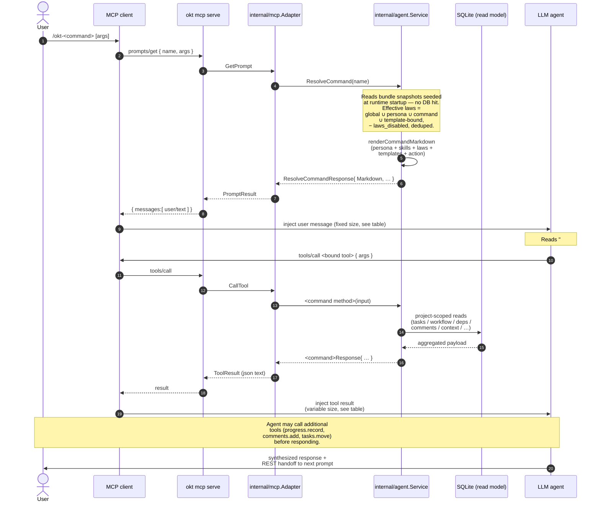

# MCP Agent Surface

Omakiten exposes a protocol-neutral agent intent layer in `internal/agent` and an MCP adapter in `internal/mcp`. The adapter maps MCP tools, resources, and prompts to the same `internal/app` services used by the CLI and TUI; it does not shell out to `okt` and does not duplicate workflow or project-scope rules.

## Setup

Users can opt in from project initialization:

```sh
okt init --enable-mcp
```

Supported harnesses are `claude-code` (default), `claude-desktop`, and `opencode`. Setup writes an `omakiten` MCP server entry that runs:

```sh
okt mcp serve
```

Useful setup flags:

- `--mcp-dry-run` previews changes without writing.
- `--mcp-config <path>` writes to a specific harness config path.
- `--mcp-command <path>` overrides the command written into the harness config.
- `--mcp-force` replaces an existing `mcpServers.omakiten` entry.

Existing harness config is preserved. Omakiten refuses to replace an existing `omakiten` MCP entry unless `--mcp-force` is passed.

## Tools

The full surface is the source of truth in `internal/mcp/adapter.go:ListTools`. Currently 29 tools, grouped below.

### Project & workflow

| Tool | Purpose |
|---|---|
| `project.overview` | Implements `/okt`: active project identity, workflow, pending count, recent context, next-step prompt. |
| `project.resume` | Implements `/okt-resume`: project distribution, likely next work, blocked/dependent work, recent context. |
| `workflow.show` | Active workflow buckets and allowed transitions. |

### Tasks

| Tool | Purpose |
|---|---|
| `tasks.continue` | Implements `/okt-continue #<id>`: task details, dependencies, comments, workflow, context. |
| `tasks.list` | Lists active project tasks with optional bucket filter. |
| `tasks.create_intent` | Implements `/okt-create <description>` with similar-task detection and confirmation gate. |
| `tasks.create` | Direct task creation equivalent to `okt add`. |
| `tasks.move` | Moves a task through allowed workflow transitions. |

### Comments & activity

| Tool | Purpose |
|---|---|
| `comments.add` | Adds a human or agent task comment, with optional tag attachment. |
| `comments.list` | Lists task comments. |
| `task_activity.list` | Unified chronological feed for a task (comments + system events such as `task.created`, `task.moved`, `task.completed`); supports `order=asc\|desc`. |

### Dependencies

| Tool | Purpose |
|---|---|
| `dependencies.add` | Adds a project-scoped dependency with cycle checks. |
| `dependencies.remove` | Requires `confirmed=true` before deleting a dependency. |
| `dependencies.list` | Lists dependencies for one task or all project tasks. |

### Context

| Tool | Purpose |
|---|---|
| `context.add` | Adds a project handoff context entry. |
| `context.dump` | Dumps compact context at level 1, 2, or 3 under a token budget. |

### Tags

| Tool | Purpose |
|---|---|
| `tags.add` | Adds a tag to a task or project. The name is normalized to kebab-case and deduplicated. |
| `tags.remove` | Removes a tag from a task or project; requires `confirmed=true`. |
| `tags.list` | Lists tags for a specific task or project. |
| `tags.list_all` | Lists all tags across all projects with usage counts. |
| `tags.merge` | Merges a source tag into a target tag, reassigning references and deleting the source. |

### Errors & solutions (cross-project)

| Tool | Purpose |
|---|---|
| `errors.record` | Records a development-time error with optional context and tags. |
| `errors.search` | Searches errors by tag intersection and/or description text; returns nested solutions ranked by success then recency. |
| `solutions.add` | Attaches a candidate solution to an error. |
| `solutions.confirm` | Marks a solution success/failure; `success=true` increments its like counter. |
| `solutions.list_top` | Lists the top-N most-liked solutions globally. |

### Templates (read-only)

| Tool | Purpose |
|---|---|
| `templates.list` | Lists every loaded template (slug, name, default kind, project scope, custom flag); optional `kind`/`project`/`include_body` filters. |
| `templates.show` | Returns one template by slug, including its full body. |

### Progress

| Tool | Purpose |
|---|---|
| `progress.record` | Records material progress through edits, comments, context, and optional workflow moves in a single call. |

Every tool accepts optional project selector fields where useful: `project_id`, `project`, and `cwd`. Resolution follows Omakiten's standard order: explicit id, explicit slug, then current working directory inside a registered project root. `tags.list_all`, `errors.*`, `solutions.*`, and `templates.list` are intentionally cross-project and ignore the selector.

## Resources

| URI | Purpose |
|---|---|
| `omakiten://project/overview` | Reads the active project overview. |
| `omakiten://workflow/active` | Reads the active workflow. |

## Prompts

`prompts/list` is built from `agent.CommandNames()`; bindings come from `mcp_commands` in `omakiten.yaml`. Each prompt resolves a persona, the union of bound laws, and any bound templates into a single user message — see the worked example below.

| Prompt | Intent |
|---|---|
| `okt` | Load project overview before continuing work. |
| `okt-imagine` | Brainstorm freely as a product owner before any task exists. |
| `okt-create` | Author a task: feasibility check, user story, scope. |
| `okt-resume` | Scan likely-next work across the active project. |
| `okt-continue` | Read a task's checkpoint as an engineer before resuming work. |
| `okt-implement` | Execute approved engineering work with strict rigor and commit discipline. |
| `okt-document` | Survey project documentation for drift and propose updates. |

The default kit follows a REST-style handoff pattern: each prompt's action text ends by suggesting the next prompt in the cycle. `okt → okt-resume / okt-imagine → okt-create → okt-continue → okt-implement` is the happy path; `okt-document` is parallel.

## Anatomy of an MCP command

Every `okt-*` prompt follows the same shape — only the bound tools and templates change. The flow is:

1. **Prompt resolution** — the MCP client sends `prompts/get` and the server returns a single composed `PromptMessage`. This message carries the bound persona, the persona's skills, every effective law (global ∪ persona ∪ command ∪ template-bound, minus `laws_disabled`), any bound templates, and the action text ending with a REST-style handoff to the next command.
2. **Tool calls (zero or more)** — the agent reads the action and calls the tool(s) named there. Most prompts point at one canonical tool (`okt-continue` → `tasks.continue`, `okt` → `project.overview`, etc.); read-only or open-ended ones (`okt-imagine`, `okt-document`) may call several or none.
3. **REST handoff** — the action text always ends with a pointer at the next prompt in the cycle, so the agent can suggest `/okt-implement` after `/okt-continue`, `/okt-create` after `/okt-imagine`, and so on.

The diagram below traces a concrete invocation — `/okt-continue 42` — but the shape applies to every prompt. Substitute the bound tool name and the DTO returned for the relevant command.



### Two-message floor

Every prompt invocation injects **at least one message** (the composed prompt) and typically a second (the tool result):

1. **The composed prompt** — one `PromptMessage` (`role: user`, `content.text: <rendered markdown>`). Size is **fixed per prompt** because no per-task data is embedded.
2. **Tool result(s)** — zero or more, depending on what the action text directs. For prompts tied to a single tool, this is one `ToolResult` carrying a JSON payload whose size **varies** with the underlying data.

For action-heavy prompts (`okt-implement`, `okt-document`) the agent will fan out and call several tools — `progress.record`, `comments.add`, `tasks.move` — each one adding another tool result message to the window. Those are the agent's choice, not the prompt's structure.

### Per-prompt fixed token cost

These are the rendered prompt sizes for the default kit (measured against the bundle shipped under `defaults/`). Numbers move with persona/skill/law/template bindings — adding a law to `mcp_commands.global.laws` adds ~50 tokens to every row.

| Prompt | Bytes | ~Tokens | Drivers |
|---|---|---|---|
| `okt-resume` | 1499 | 375 | engineer persona + 5 skills + 4 laws |
| `okt` | 1521 | 380 | engineer persona + 5 skills + 4 laws |
| `okt-continue` | 1682 | 420 | engineer persona + 5 skills + 4 laws |
| `okt-imagine` | 1767 | 440 | product-owner persona + 3 skills + 4 laws (template-fidelity disabled) |
| `okt-document` | 2260 | 565 | documentation-agent + 5 skills + 5 laws |
| `okt-create` | 2866 | 720 | product-owner + 3 skills + 5 laws + user-story template inline |
| `okt-implement` | 3708 | 930 | engineer + 5 skills + 7 laws + pull-request template inline |

### Variable tool-result cost — `okt-continue` worked example

The fixed prompt is only half the picture. For prompts that fetch task state, the tool result dominates. `tasks.continue` ships:

- the full `task` (title + description — descriptions can be thousands of chars on rich tasks);
- the active workflow shape (~150 tokens, redundant if `okt` already ran in the session);
- dependencies for the task;
- the last 5 comments reversed-chronological with full body and tags;
- the last 3 project context entries;
- a `next_step_prompt` string.

For a fresh task this lands at ~400 tokens; for a long-running task with verbose `#resume` and `#documentation` comments, 3000+ tokens is realistic. So:

| Component | Tokens (typical) | Source |
|---|---|---|
| `okt-continue` prompt | ~420 | Fixed; `service.ResolveCommand` rendering |
| `tasks.continue` tool result | 400 – 3000+ | Varies; dominated by `comments[]` body length |
| **Total per `/okt-continue`** | **~800 – 3500** | |

### Tuning context cost

The biggest variable is the tool result, not the prompt. Four knobs in `config.mcp` (see `.docs/configuration-guide.md#configmcp`) shape it without changing the protocol:

| Setting | Affects | Typical saving on `/okt-continue` |
|---|---|---|
| `recent_comment_limit` (int, default `5`) | Caps the comment-tail length in every checkpoint endpoint. Drop to `3` on tasks with many `#resume` notes. | ~40% of the `comments[]` block |
| `max_comment_chars` (int, default `0`) | Truncates each comment body past N runes with `…`. Set to ~`500` for a hard floor while keeping the latest exchange readable. | ~50–70% of the `comments[]` block when bodies are long |
| `include_workflow_in_continue` (`*bool`, default `true`) | Skips the `workflow` block in `tasks.continue`. The agent already has the workflow from the first `/okt` of the session — set `false` to stop re-shipping. | ~150 fixed tokens per call |
| `cache_prompts` (`*bool`, default `true`) | Emits an Anthropic `cache_control` hint on `prompts/get` content. Aware clients reuse the cached prompt across calls. | ~90% of the prompt (~380 tokens) on subsequent calls within the cache window |

The same accounting applies to every prompt — substitute the bound tool's DTO for the variable row above. `comments.list` is intentionally exempt from `max_comment_chars` because it's the explicit "read the full thread" endpoint; truncation would make the call useless.

Per-call overrides are available where they make sense: `tasks.continue` accepts an `include_workflow` boolean argument that wins over the config default for that single call.

## Confirmation Behavior

Ambiguous or destructive operations return `requires_confirmation` instead of mutating state.

- `tasks.create_intent` returns similar tasks and asks whether to continue existing work or retry with `confirmed=true`.
- `dependencies.remove` asks for `confirmed=true` before deleting the dependency.
- `tags.remove` asks for `confirmed=true` before detaching the tag from a task or project.

## Failure Guidance

Domain errors are mapped to compact coded failures with next-step guidance (`internal/agent/errors.go:guidanceForCode`). Codes currently defined in `internal/domain/errors.go`:

`config_invalid`, `project_not_found`, `project_ambiguous`, `task_not_found`, `workflow_invalid_transition`, `bucket_not_found`, `dependency_invalid`, `validation_error`, `law_not_found`, `skill_not_found`, `persona_not_found`, `skill_referenced`, `editor_failed`, `tag_not_found`, `tag_conflict`, `guard_violation`, `error_not_found`, `solution_not_found`.

## Scope Controls

- All reads and writes resolve one active `ProjectContext` at intent entry, except for the explicitly cross-project tools listed above (`tags.list_all`, `errors.*`, `solutions.*`, `templates.list`).
- Tasks, comments, dependencies, context entries, and tags are read or written through project-scoped repositories.
- Workflow movement goes through `app.WorkflowService.MoveTask` (transition allowance + guards + `task.completed` emission); task edits go through `app.TaskService.Edit`.
- The core `internal/agent` package has no MCP SDK, package-manager, or transport dependency. The composition root for the MCP server is `internal/agentruntime`; the protocol translation lives in `internal/mcp`.
- Hexagonal boundaries (no `agent` → `sqlite`/`configstore`/`mcp` imports) are enforced by `internal/arch/arch_test.go` and mirrored as `depguard` rules in `.golangci.yml`.
