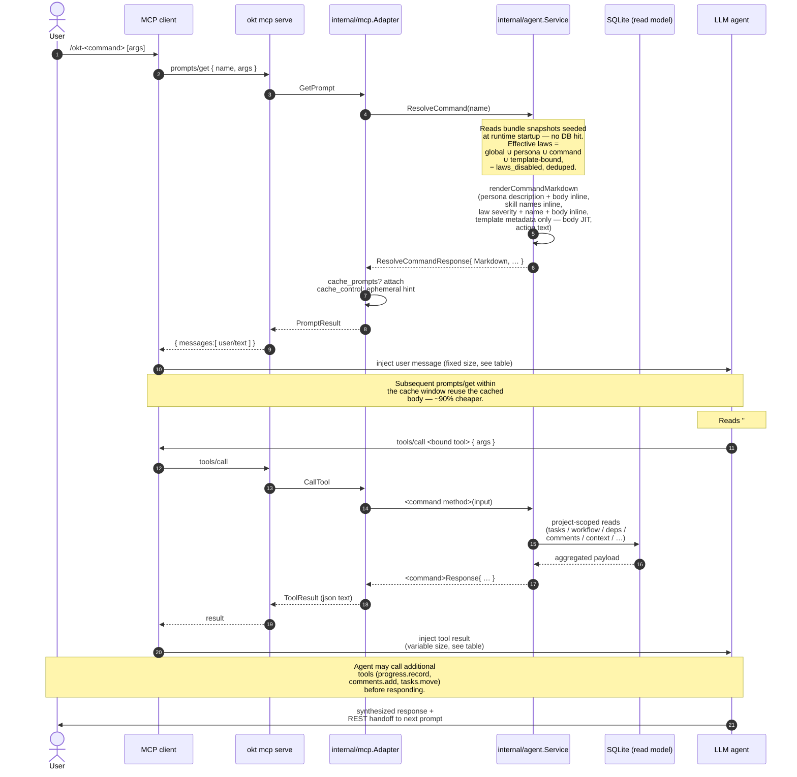

# MCP Agent Surface

Omakiten exposes a protocol-neutral agent intent layer in `internal/agent` and an MCP adapter in `internal/mcp`. The adapter maps MCP tools, resources, and prompts to the same `internal/app` services used by the CLI and TUI; it does not shell out to `okt` and does not duplicate workflow or project-scope rules.

## Setup

Users can opt in from project initialization:

```sh
okt init --enable-mcp
```

Supported harnesses (CLI value → config target):

| Harness | Default config path | Format | Server entry root |
|---|---|---|---|
| `claude-code` *(default)* | `~/.claude.json` | JSON | `mcpServers.omakiten` |
| `claude-desktop` | `<UserConfigDir>/Claude/claude_desktop_config.json` | JSON | `mcpServers.omakiten` |
| `opencode` | `<UserConfigDir>/opencode/opencode.json` | JSON | `mcp.omakiten` |
| `crush` | `~/.config/crush/crush.json` (Linux/macOS) · `%LOCALAPPDATA%\crush\crush.json` (Windows) | JSON | `mcp.omakiten` |
| `github-copilot` | `<UserConfigDir>/Code/User/mcp.json` (VS Code Copilot Chat, agent mode) | JSON | `servers.omakiten` |
| `codex` | `~/.codex/config.toml` | TOML | `[mcp_servers.omakiten]` |

Setup writes an `omakiten` server entry that runs:

```sh
okt mcp serve
```

Useful setup flags:

- `--mcp-dry-run` previews changes without writing.
- `--mcp-config <path>` writes to a specific harness config path.
- `--mcp-command <path>` overrides the command written into the harness config.
- `--mcp-force` replaces an existing `omakiten` entry.

Existing harness config is preserved (unrelated keys, other MCP servers, and any TOML tables outside `[mcp_servers]` round-trip untouched). Omakiten refuses to replace an existing `omakiten` MCP entry unless `--mcp-force` is passed.

### Bundled installer flow

Both `install.sh` and `install.ps1` end with an interactive multi-select prompt that lists every supported harness and runs `okt mcp setup --harness X --force` for each one chosen — no separate setup step required. Use the env override `OKT_HARNESSES=claude-code,opencode` (comma/space/tab/newline separated) to pre-pick selections and skip the prompt; in non-interactive shells (CI, no `/dev/tty`, non-`UserInteractive` PowerShell) the prompt is silently skipped.

### Inspecting prompts

```sh
okt mcp prompts            # render every okt-* prompt
okt mcp prompts okt-implement   # render one
```

Resolves each `okt-*` prompt through the running agent service (using your active config) and prints the composed markdown to stdout, separated by horizontal rules and annotated with byte/rune counts. Useful for previewing the exact prompt the agent receives without spinning up an MCP client.

`mise run mcp:prompts` is the contributor shortcut: syncs `dev_env/` defaults and runs the same command against them.

## Tools

The full surface is the source of truth in `internal/mcp/adapter.go:ListTools`. Currently 30 tools, grouped below.

### Required `_agent_model` on every call

Every tool call must carry a top-level `_agent_model` string identifying the AI model invoking the tool (e.g. `"claude-opus-4-7"`, `"claude-sonnet-4-6"`, `"gpt-5"`). Calls without it return `validation_error` with self-describing guidance — the agent can fix its own request without a follow-up.

An optional `_agent_session_id` lets the metrics layer correlate searches to records within a session (used by `metrics.summary`'s `search_before_record_ratio`). Both fields are stripped from the input before tool-specific decoding, so they never leak into per-tool DTOs. They are denormalized on every write (`events`, `errors`, `solutions`) so cross-table benchmarks don't need joins.

System-internal entry points (`ReadResource`) bypass the coercive check and write empty attribution so synthetic samples don't pollute the benchmark.

### Project & workflow

| Tool | Purpose |
|---|---|
| `project.overview` | Implements `/okt`: active project identity, workflow, pending count, recent context, next-step prompt. |
| `project.resume` | Implements `/okt-resume`: project distribution, likely next work, blocked/dependent work, recent context. |
| `workflow.show` | Active workflow buckets and allowed transitions. |

### Tasks

| Tool | Purpose |
|---|---|
| `tasks.continue` | Implements `/okt-continue #<id>`: task details, dependencies, comments, workflow, context. |
| `tasks.list` | Lists active project tasks with optional bucket filter. |
| `tasks.create_intent` | Implements `/okt-create <description>` with similar-task detection and confirmation gate. |
| `tasks.create` | Direct task creation equivalent to `okt add`. |
| `tasks.move` | Moves a task through allowed workflow transitions. |
| `tasks.delete` | Hard-deletes a task with cascade (comments, tags, dependencies, events). Subject to bucket `permissions.task.delete` and `operations.delete.guards`. Requires `confirmed=true`. |
| `tasks.archive` | Flips `state=archived` and moves the task to the workflow's final bucket. Bypasses bucket policy and transition guards but respects `operations.archive.guards`. |
| `tasks.unarchive` | Restores `state=active` while leaving the bucket untouched. Respects `operations.unarchive.guards` if declared. |

### Comments & activity

| Tool | Purpose |
|---|---|
| `comments.add` | Adds a human or agent task comment, with optional tag attachment. |
| `comments.list` | Lists task comments. |
| `comments.edit` | Rewrites a comment's body and replaces its tags. Subject to bucket `permissions.comment.edit` (inherits from `permissions.task.edit` when no comment block is declared). |
| `comments.delete` | Hard-deletes a comment. Subject to bucket `permissions.comment.delete` (same inheritance rule). Requires `confirmed=true`. |
| `task_activity.list` | Unified chronological feed for a task (comments + system events such as `task.created`, `task.moved`, `task.completed`, `task.archived`, `task.removed`, `comment.edited`, `comment.removed`); supports `order=asc\|desc`. |

### Dependencies

| Tool | Purpose |
|---|---|
| `dependencies.add` | Adds a project-scoped dependency with cycle checks. |
| `dependencies.remove` | Requires `confirmed=true` before deleting a dependency. |
| `dependencies.list` | Lists dependencies for one task or all project tasks. |

### Context

| Tool | Purpose |
|---|---|
| `context.add` | Adds a project handoff context entry. |
| `context.dump` | Dumps compact context at level 1, 2, or 3 under a token budget. |

### Tags

| Tool | Purpose |
|---|---|
| `tags.add` | Adds a tag to a task or project. The name is normalized to kebab-case and deduplicated. |
| `tags.remove` | Removes a tag from a task or project; requires `confirmed=true`. |
| `tags.list` | Lists tags for a specific task or project. |
| `tags.list_all` | Lists all tags across all projects with usage counts. |
| `tags.merge` | Merges a source tag into a target tag, reassigning references and deleting the source. |

### Errors & solutions (cross-project)

| Tool | Purpose |
|---|---|
| `errors.record` | Records a development-time error with optional context and tags. |
| `errors.search` | Searches errors by tag intersection and/or description text; returns nested solutions ranked by success then recency. |
| `solutions.add` | Attaches a candidate solution to an error. |
| `solutions.confirm` | Marks a solution success/failure; `success=true` increments its like counter. |
| `solutions.list_top` | Lists the top-N most-liked solutions globally. |

### Templates (read-only)

| Tool | Purpose |
|---|---|
| `templates.list` | Lists every loaded template (slug, name, default kind, project scope, custom flag); optional `kind`/`project`/`include_body` filters. |
| `templates.show` | Returns one template by slug, including its full body. **Strict shadow validation:** when an active project resolves (via `project_id` / `project` / `cwd`) and the requested slug refers to a global template that the project shadows with an override of the same `default` kind, the call hard-rejects with `validation_error`. The rejection's `details` name `active_slug` so the agent can re-call directly. Outside any registered project, current slug-only lookup is preserved. An explicit `project` / `project_id` that does not resolve propagates `project_not_found` rather than falling back. |

### Metrics (cross-agent benchmarking)

| Tool | Purpose |
|---|---|
| `metrics.summary` | Aggregates per-AI-model behaviour over a period: errors recorded, errors searched, solutions added, like rate, and search-before-record ratio. Period defaults to `30d` (also accepts `7d` and `all`); invalid values fall back to `30d`. Optional `project_id` narrows the view to one project; omit for the cross-project benchmark. Models that never pass `_agent_session_id` report `0.0` for `search_before_record_ratio` even if they search heavily — correlating searches to records requires session continuity, by design. Rows with empty `agent_model` (TUI human, system internals) are excluded. |

### Progress

| Tool | Purpose |
|---|---|
| `progress.record` | Records material progress through edits, comments, context, and optional workflow moves in a single call. |

Every tool accepts optional project selector fields where useful: `project_id`, `project`, and `cwd`. Resolution follows Omakiten's standard order: explicit id, explicit slug, then current working directory inside a registered project root. `tags.list_all`, `errors.*`, `solutions.*`, `templates.list`, and `metrics.summary` are intentionally cross-project and ignore the selector (`metrics.summary` accepts a separate `project_id` filter argument when scoped is desired).

## Resources

| URI | Purpose |
|---|---|
| `omakiten://project/overview` | Reads the active project overview. |
| `omakiten://workflow/active` | Reads the active workflow. |

## Prompts

`prompts/list` is built from `agent.CommandNames()`; bindings come from `mcp_commands` in `omakiten.yaml`. Each prompt resolves a persona, the union of bound laws, and any bound templates into a single user message — see the worked example below.

| Prompt | Intent |
|---|---|
| `okt` | Load project overview before continuing work. |
| `okt-imagine` | Brainstorm freely as a product owner before any task exists. |
| `okt-create` | Author a task: feasibility check, user story, scope. |
| `okt-resume` | Scan likely-next work across the active project. |
| `okt-continue` | Read a task's checkpoint as an engineer before resuming work. |
| `okt-implement` | Execute approved engineering work with strict rigor and commit discipline. |
| `okt-document` | Survey project documentation for drift and propose updates. |
| `okt-config` | Orient the agent on the active Omakiten config layout before edits. |

The default kit follows a REST-style handoff pattern: each prompt's action text ends by suggesting the next prompt in the cycle. `okt → okt-resume / okt-imagine → okt-create → okt-continue → okt-implement` is the happy path; `okt-document` and `okt-config` are parallel.

## Anatomy of an MCP command

Every `okt-*` prompt follows the same shape — only the bound tools and templates change. The flow is:

1. **Prompt resolution** — the MCP client sends `prompts/get` and the server returns a single composed `PromptMessage`. This message carries the bound persona, the persona's skills, every effective law (global ∪ persona ∪ command ∪ template-bound, minus `laws_disabled`), any bound templates, and the action text ending with a REST-style handoff to the next command.
2. **Tool calls (zero or more)** — the agent reads the action and calls the tool(s) named there. Most prompts point at one canonical tool (`okt-continue` → `tasks.continue`, `okt` → `project.overview`, etc.); read-only or open-ended ones (`okt-imagine`, `okt-document`) may call several or none.
3. **REST handoff** — the action text always ends with a pointer at the next prompt in the cycle, so the agent can suggest `/okt-implement` after `/okt-continue`, `/okt-create` after `/okt-imagine`, and so on.

The diagram below traces a concrete invocation — `/okt-continue 42` — but the shape applies to every prompt. Substitute the bound tool name and the DTO returned for the relevant command.



### Two-message floor

Every prompt invocation injects **at least one message** (the composed prompt) and typically a second (the tool result):

1. **The composed prompt** — one `PromptMessage` (`role: user`, `content.text: <rendered markdown>`). Size is **fixed per prompt** because no per-task data is embedded.
2. **Tool result(s)** — zero or more, depending on what the action text directs. For prompts tied to a single tool, this is one `ToolResult` carrying a JSON payload whose size **varies** with the underlying data.

For action-heavy prompts (`okt-implement`, `okt-document`) the agent will fan out and call several tools — `progress.record`, `comments.add`, `tasks.move` — each one adding another tool result message to the window. Those are the agent's choice, not the prompt's structure.

### What ships inline vs JIT

Not every entity body trafega in the prompt. The renderer pre-loads what the agent needs at resolution time and defers heavy bodies to dedicated tools:

| Entity | What ships in the prompt | When body is fetched |
|---|---|---|
| Persona | `description` + full `body` (inline under `## Persona`) | Always inline — body carries the role's procedural loop |
| Skills | Names only, inline list under `## Skills — A, B, C` | Never — descriptions are decorative; procedure lives in persona body / action text |
| Laws | `severity` + `name` + full `body` (inline under `## Laws`) | Always inline — laws are constraints that must frame every step |
| Templates | Slug + optional name (when divergent from slug) + default kind + description | On demand via `templates.show <slug>` — bodies are large (the `pull-request` scaffold is ~700 tokens by itself) |

The fetch hint for templates lives in the action text or the bound persona's body — not as a generic footer — so the prompt only mentions `templates.show` for commands that actually need it. `internal/agentruntime.TestTemplateBoundCommandsCarryFetchHint` enforces that contract: every `okt-*` prompt with bound templates must surface the hint somewhere in its rendered Markdown.

This follows Anthropic's just-in-time context engineering principle: ship lightweight identifiers, let the agent fetch payloads on demand. The `template-fidelity` law remains pre-loaded (it is a constraint that must shape the fetch when it happens), but the body the constraint applies to lives behind a tool call.

Trade-off: one extra MCP round-trip on the materialization step (only when the agent actually drafts the PR or fills the scaffold), in exchange for hundreds of tokens saved on every prompt resolution that does not reach materialization.

### What does NOT ship in the prompt body

- Prompt name and description — both already exposed via `prompts/list` metadata in the MCP protocol; aware clients surface them before calling `prompts/get`. Echoing them in the body would just duplicate bytes the agent already has.
- Skill descriptions — see table above.
- Law count parenthetical — `## Laws` carries no `(N)` suffix; the agent does not branch on the number.

### Per-prompt fixed token cost

Rendered prompt sizes for the default kit, measured via `mise run mcp:prompts`. Numbers move with persona body / skill / law / template bindings — adding a law to `mcp_commands.global.laws` adds ~50 tokens to every row.

| Prompt | Bytes | ~Tokens | Drivers |
|---|---|---|---|
| `okt-imagine` | 1714 | 430 | product-owner + 3 skills + 4 laws (template-fidelity disabled) |
| `okt-resume` | 1762 | 440 | engineer + 2 skills + 4 laws + persona body (implement loop) |
| `okt` | 1778 | 445 | engineer + 2 skills + 4 laws + persona body (implement loop) |
| `okt-continue` | 1849 | 460 | engineer + 2 skills + 4 laws + persona body (implement loop) |
| `okt-document` | 2073 | 520 | documentation-agent + 5 skills + 5 laws |
| `okt-config` | 2332 | 585 | documentation-agent + 5 skills + 5 laws + config-orientation metadata (JIT) |
| `okt-create` | 2553 | 640 | product-owner + 3 skills + 5 laws + user-story metadata (JIT) |
| `okt-implement` | 3969 | 990 | engineer + 2 skills + 8 laws + persona body (implement loop) + pull-request metadata (JIT) |

Without JIT, `okt-implement` would carry the full `pull-request` body (~700 extra tokens, putting it past 1690). The same logic applies to any user-authored template — bind it via `mcp_commands.<cmd>.templates` and only metadata ships in the prompt.

A regression test (`internal/agentruntime/prompt_budget_test.go`) caps each prompt at current size + ~30% headroom; once a future change pushes a prompt past its budget the test fails and forces a deliberate tradeoff (trim entity bodies, add a JIT optimization, or raise the budget with justification).

### Prompt engineering principles applied

The default kit follows Anthropic's [context engineering for AI agents](https://www.anthropic.com/engineering/effective-context-engineering-for-ai-agents) guidance. Customizers who add their own commands, laws, or templates should match these conventions so the resolved prompts stay coherent:

- **Right altitude in action texts.** Action text describes the command's contract — name the canonical tool, end with a REST handoff. **Role lives in the persona body** (rendered in `## Persona`); **constraints live in bound laws** (rendered in `## Laws`); **scaffold lives in the templates section**. Action text never restates any of those — `mcp_commands.<cmd>.persona` is configurable, so persona-coupled prose in the action would leak engineer-specific instructions into prompts that bind a different persona. The persona body is the single source of truth for "how this role works"; the laws are the single source for "what is forbidden / required"; the action is just the command-specific bootstrap and handoff.
- **Just-in-time over pre-loading.** Template bodies are fetched via `templates.show` rather than embedded inline. The same logic applies to any heavy artifact (long context entries, large dumps): expose a tool, ship the slug, let the agent pull the body when actually needed.
- **Few-shot examples in load-bearing laws.** Laws that govern judgment calls (`template-fidelity`, `conventional-commits`, `no-assumptions`, `self-report`) carry a `Bad:` / `Good:` micro-example after the directive paragraph. Anthropic's principle: examples teach generalization better than abstract rules. Plain text labels (no emoji) keep the prompt readable across terminals and clients.
- **No conditional logic in prompts.** Anti-pattern: `if returns requires_confirmation, ask the user…`. Instead, the server's response carries an actionable `Reason` field that names the next-step tools — the agent acts on the response shape, not on prompt-side branching. See `agent.Confirmation.Reason` in `internal/agent/dto.go`.
- **Failure-driven additions.** Add a law or example only after observing a real failure mode. `template-fidelity` was added because the agent fabricated `Closes #40`; `authorize-remote-writes` was added because `git push` is destructive. Don't speculate.
- **Markdown sections, not XML tags.** The renderer uses `## Persona`, `## Skills`, `## Laws`, `## Templates`, `## Action`. Same load-bearing structure Anthropic recommends, but markdown reads cleanly in both the agent prompt and a developer's terminal when debugging.

### Variable tool-result cost — `okt-continue` worked example

The fixed prompt is only half the picture. For prompts that fetch task state, the tool result dominates. `tasks.continue` ships:

- the full `task` (title + description — descriptions can be thousands of chars on rich tasks);
- the active workflow shape (~150 tokens, redundant if `okt` already ran in the session);
- dependencies for the task;
- the last 5 comments reversed-chronological with full body and tags;
- the last 3 project context entries;
- a `next_step_prompt` string.

For a fresh task this lands at ~400 tokens; for a long-running task with verbose `#resume` and `#documentation` comments, 3000+ tokens is realistic. So:

| Component | Tokens (typical) | Source |
|---|---|---|
| `okt-continue` prompt | ~420 | Fixed; `service.ResolveCommand` rendering |
| `tasks.continue` tool result | 400 – 3000+ | Varies; dominated by `comments[]` body length |
| **Total per `/okt-continue`** | **~800 – 3500** | |

### Tuning context cost

The biggest variable is the tool result, not the prompt. Four knobs in `config.mcp` (see `.docs/configuration-guide.md#configmcp`) shape it without changing the protocol:

| Setting | Affects | Typical saving on `/okt-continue` |
|---|---|---|
| `recent_comment_limit` (int, default `5`) | Caps the comment-tail length in every checkpoint endpoint. Drop to `3` on tasks with many `#resume` notes. | ~40% of the `comments[]` block |
| `max_comment_chars` (int, default `0`) | Truncates each comment body past N runes with `…`. Set to ~`500` for a hard floor while keeping the latest exchange readable. | ~50–70% of the `comments[]` block when bodies are long |
| `include_workflow_in_continue` (`*bool`, default `true`) | Skips the `workflow` block in `tasks.continue`. The agent already has the workflow from the first `/okt` of the session — set `false` to stop re-shipping. | ~150 fixed tokens per call |
| `cache_prompts` (`*bool`, default `true`) | Emits an Anthropic `cache_control` hint on `prompts/get` content. Aware clients reuse the cached prompt across calls. | ~90% of the prompt (~380 tokens) on subsequent calls within the cache window |

The same accounting applies to every prompt — substitute the bound tool's DTO for the variable row above. `comments.list` is intentionally exempt from `max_comment_chars` because it's the explicit "read the full thread" endpoint; truncation would make the call useless.

Per-call overrides are available where they make sense: `tasks.continue` accepts an `include_workflow` boolean argument that wins over the config default for that single call.

## Confirmation Behavior

Ambiguous or destructive operations return `requires_confirmation` instead of mutating state.

- `tasks.create_intent` returns similar tasks and asks whether to continue existing work or retry with `confirmed=true`.
- `dependencies.remove` asks for `confirmed=true` before deleting the dependency.
- `tags.remove` asks for `confirmed=true` before detaching the tag from a task or project.

## Failure Guidance

Domain errors are mapped to compact coded failures with next-step guidance (`internal/agent/errors.go:guidanceForCode`). Codes currently defined in `internal/domain/errors.go`:

`config_invalid`, `project_not_found`, `project_ambiguous`, `task_not_found`, `workflow_invalid_transition`, `bucket_not_found`, `dependency_invalid`, `validation_error`, `law_not_found`, `skill_not_found`, `persona_not_found`, `skill_referenced`, `editor_failed`, `tag_not_found`, `tag_conflict`, `guard_violation`, `error_not_found`, `solution_not_found`.

## Scope Controls

- All reads and writes resolve one active `ProjectContext` at intent entry, except for the explicitly cross-project tools listed above (`tags.list_all`, `errors.*`, `solutions.*`, `templates.list`).
- Tasks, comments, dependencies, context entries, and tags are read or written through project-scoped repositories.
- Workflow movement goes through `app.WorkflowService.MoveTask` (transition allowance + guards + `task.completed` emission); task edits go through `app.TaskService.Edit`.
- The core `internal/agent` package has no MCP SDK, package-manager, or transport dependency. The composition root for the MCP server is `internal/agentruntime`; the protocol translation lives in `internal/mcp`.
- Hexagonal boundaries (no `agent` → `sqlite`/`configstore`/`mcp` imports) are enforced by `internal/arch/arch_test.go` and mirrored as `depguard` rules in `.golangci.yml`.
