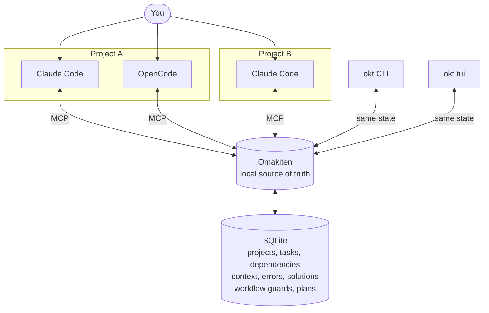
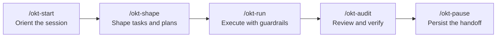

# Omakiten

**The local source of truth for your AI agents.**

Omakiten is a local checkpoint system for AI-assisted development. No cloud. No account. No telemetry. Just you, your projects, your agents, and a SQLite database on your machine.

[](https://github.com/This-Is-NPC/omakiten/releases)
[](LICENSE)

<p align="center">
  21 languages | 100% local | Open source | Zero telemetry
</p>

---

## The Problem

AI agents lose context between sessions. Different tools see different parts of the work. One agent rediscovers the bug another agent already fixed. You repeat the same explanation. They repeat the same mistake.

Omakiten gives your agents a shared local source of truth before they continue: tasks, dependencies, workflow state, decisions, errors, solutions, handoff notes, and plans in one place they can read and write through MCP.

---

## How It Works

You keep working with whichever agent you prefer. Omakiten sits underneath them as the shared checkpoint for every project and every supported MCP harness.



The important part is the direction of control: you interact with the agents, and the agents coordinate through Omakiten. Claude Code in Project A, Claude Code in Project B, and OpenCode in Project A can all read from the same local state without inventing their own memory.

---

## What It Solves

| Workflow guardrails | Memory between sessions | Unified search |
|---|---|---|
| Rules like *"do not leave `dev` without a review comment"* apply to agents too. Guards are project-scoped, so Project A can enforce strict review gates while Project B keeps a lighter flow. Forbidden moves return explicit errors, not silent state changes. | Tasks, comments, errors, solutions, and handoff context persist in SQLite. Agents resume from the real state, even days later. | Full-text search (FTS5) spans projects on your machine. *"Have we seen this error before?"* finally has an answer. |

| Multi-agent plans | 21 languages | Events and hooks |
|---|---|---|
| Group work into ordered waves. Agents claim work atomically through SQLite, so the same task is never picked twice. Wave gates prevent work from jumping ahead. | CLI, TUI, and agent output language are configured independently. Use English in the terminal, Portuguese in the board, and Japanese for agent replies. | Typed events like `task.created`, `error.recorded`, and `guard.violated` can trigger async YAML hooks. Per-model AI metrics are included. |

---

## The Agent Workflow

Omakiten ships canonical MCP prompts as a command router for agents. The happy path is orchestrator-first: orient the session, shape the work, run the implementation, audit the result, then persist a handoff.



`/okt` is the short form of `/okt-start`. Orchestrators decide the next move and delegate to precise granular commands like `okt-task-*`, `okt-plan-*`, and `okt-note-*` when the step is already known.

### Daily Command Highlights

| Prompt | Use it when you want to |
|---|---|
| `/okt` / `/okt-start` | Start a session with project identity, active workflow, pending work, handoff notes, and suggested next commands. |
| `/okt-shape` | Turn an idea, backlog item, or rough task into validated tasks and ordered plan waves. |
| `/okt-run` | Drive an approved task or plan through implementation with workflow guardrails. |
| `/okt-audit` | Coordinate review, security, and quality passes over a task, plan, or diff. |
| `/okt-pause` | Close the session with a project-scoped handoff note for the next agent. |
| `/okt-task-continue` | Resume one task with dependencies, comments, workflow position, and recent context loaded at once. |
| `/okt-task-implement` | Execute an approved increment and record progress, evidence, or follow-up context. |
| `/okt-task-review` | Review the current diff with findings, risk notes, and file-level feedback. |
| `/okt-task-check` | Discover and run the project's check targets, then report pass/fail clearly. |
| `/okt-task-commit` | Draft Conventional Commits from the working tree without pushing. |
| `/okt-plan-claim` | Atomically reserve the next claimable task from a plan wave. |
| `/okt-note-free` | Capture a free-form project or universal note without ceremony. |
| `/okt-note-recap` | Render a recap timeline from notes, handoffs, and completed work. |

Natural language works too:

| What you say | What the agent does |
|---|---|
| "What is the state of this project?" | Reads `project.overview`. |
| "Pick up where we left off." | Reads `project.resume`. |
| "Move task 17 to review." | Calls `tasks.move`; transition rules still apply. |
| "Have we seen this error before?" | Searches tasks, comments, errors, solutions, and context across projects. |
| "That solution worked." | Confirms the solution as known-good. |

[See the command surface](.docs/command-surface.md) and [full MCP reference](.docs/mcp.md): 53 tools, 2 resources, and 40 prompts.

---

## Install

**Linux / macOS / WSL:**

```bash
curl -fsSL https://raw.githubusercontent.com/This-Is-NPC/omakiten/master/install.sh | bash
```

**Windows (PowerShell):**

```powershell
irm https://raw.githubusercontent.com/This-Is-NPC/omakiten/master/install.ps1 | iex
```

The installer opens an interactive picker: CLI/TUI language, agent-output language, workflow preset, and MCP harnesses. For headless installs in CI, Dockerfiles, or dotfiles, provide environment variables:

| Variable | Defines |
|---|---|
| `OKT_CLI_LANG` | CLI/TUI language, for example `pt-br` or `en`. |
| `OKT_TUI_LANG` | CLI/TUI language when `OKT_CLI_LANG` is omitted. |
| `OKT_AGENT_LANG` | Language agents use when responding. |
| `OKT_PRESET` | Workflow preset: `omakase`, `izakaya`, `kaiseki`, or `shokunin`. |
| `OKT_HARNESSES` | MCP harnesses, for example `claude-code,codex,opencode`, or `0` for none. |

```bash
OKT_CLI_LANG=en OKT_AGENT_LANG="English" OKT_PRESET=omakase OKT_HARNESSES=claude-code,opencode \
  bash <(curl -fsSL https://raw.githubusercontent.com/This-Is-NPC/omakiten/master/install.sh)
```

Supported MCP harnesses include `claude-code`, `claude-desktop`, `codex`, `crush`, `github-copilot`, and `opencode`.

---

## Your First Project

```bash
# Register the current project
okt init --name MyProject --slug my-project

# Inspect the current state
okt list

# Open the visual interface
okt tui
```

Per-project configuration is supported. Put `.omakiten/config/omakase.yaml` in the repository root and Omakiten loads that workflow whenever you are inside the project tree. Guards, bucket rules, hooks, workflow snapshots, task state, and migration paths stay isolated per project.

---

## Four Work Disciplines

Each preset is a process discipline, not an architecture prescription. Omakiten does not force DDD, Clean Architecture, or any framework-specific structure.

| Preset | Spirit | Use it for |
|---|---|---|
| **omakase** | Trunk-based development, TDD, Conventional Commits, boy-scout cleanup. | The balanced default for professional software work. |
| **izakaya** | Lean startup, spikes, tracer bullets, walking skeletons. | Prototypes, side projects, experiments, and low-ceremony work. |
| **kaiseki** | Staged delivery, formal sign-offs, documented decisions. | Planned features in serious codebases with multiple stakeholders. |
| **shokunin** | SRE discipline, pre-mortems, multi-reviewer change control, blameless postmortems. | Regulated environments, irreversible changes, and audit-heavy work. |

Presets define workflow discipline and guardrails. Configuration is modular when teams need to customize one part without replacing the whole preset.

---

## What Changes Day To Day

**Before:** You explain the project from scratch to every agent. They suggest changes that violate the team's process. The same error comes back because the previous fix lived only in a chat transcript.

**After:** Each agent reads the checkpoint before acting. Workflow rules are enforced at the shared state layer. Search crosses projects. Handoff notes survive sessions. You spend less time repeating context and more time building.

---

## TUI

`okt tui` opens a terminal UI with three zones: **Tasks** (board, table, graph, plans), **Stats** (per-model benchmark, logs), and **Settings** (runtime info, entity browser). Task descriptions, comments, and entity files render as styled markdown; press `M` to toggle raw mode.

Outside a project, it opens a multi-project home. Pick a project, work on it, and the shell `cd`s into that project's folder when you exit.

[Read the full TUI guide](.docs/tui.md)

---

## Update And Uninstall

```bash
okt update --check    # check without changing anything
okt update --yes      # download and atomically swap the binary

okt uninstall --yes             # remove binary and wrapper, keep data
okt uninstall --yes --purge     # remove everything, including data and config
```

Both commands fall back to an interactive picker when called without flags in a TTY.

---

## Documentation

| Audience | Start here |
|---|---|
| **Understand the why** | [`.docs/why_omakiten.md`](.docs/why_omakiten.md): positioning, mental models, PDCA, 5W2H, SMART, INVEST, bibliography. |
| **Compare presets** | [`.docs/presets.md`](.docs/presets.md): side-by-side comparison of the four presets. |
| **Understand commands** | [`.docs/command-surface.md`](.docs/command-surface.md): command tiers, roles, scopes, and write behavior. |
| **Configure Omakiten** | [`.docs/configuration-guide/README.md`](.docs/configuration-guide/README.md): one document per feature with inline YAML schemas. |
| **Contribute** | [`.docs/internal/architecture.md`](.docs/internal/architecture.md): hexagonal architecture, snapshot pattern, data model. |
| **CLI reference** | [`.docs/cli.md`](.docs/cli.md): flags, subcommands, JSON envelope. |
| **MCP reference** | [`.docs/mcp.md`](.docs/mcp.md): tools, resources, prompts, and harness setup. |

Master index: [`.docs/README.md`](.docs/README.md)

---

## Project

- [Changelog](CHANGELOG.md)
- [Contributing](CONTRIBUTING.md)
- [License](LICENSE)

<p align="center">
  <strong><a href="https://github.com/This-Is-NPC/omakiten/releases">Install now</a></strong>
  &nbsp;&middot;&nbsp;
  <strong><a href=".docs/why_omakiten.md">Read the manifesto</a></strong>
</p>
