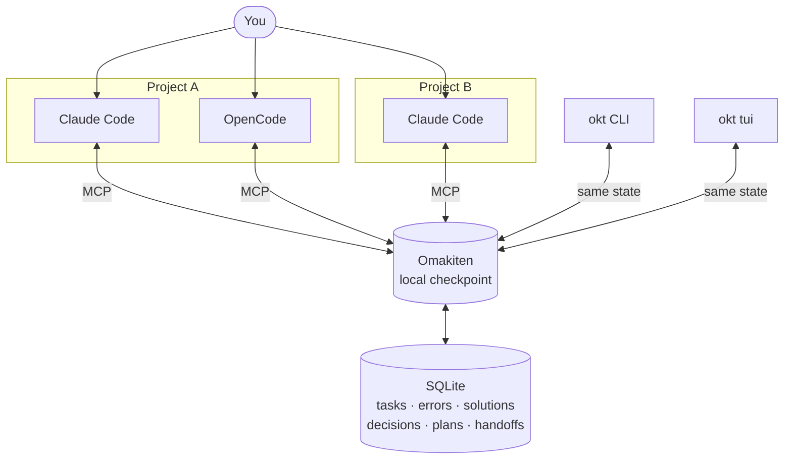
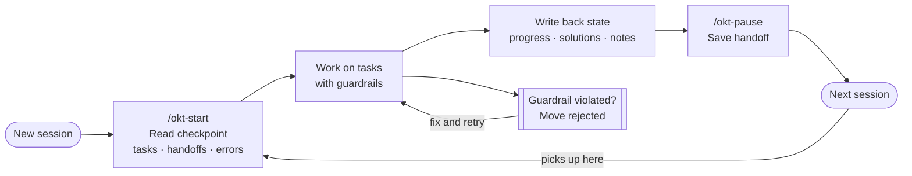

# Omakiten

**A checkpoint layer for AI-assisted development.**

Your AI agents forget everything when the session ends. Omakiten is the checkpoint they read before acting and write before leaving — so the next agent picks up from real state, not a blank slate.

[](https://github.com/This-Is-NPC/omakiten/releases)
[](LICENSE)

<p align="center">
  21 languages · 100% local · Open source · Zero telemetry
</p>

---

## The Problem

AI agents lose context between sessions. Different tools see different parts of your work. One agent rediscovers a bug another already fixed. You repeat the same explanation. They repeat the same mistake.

**Omakiten gives your agents a shared checkpoint:** tasks, decisions, errors, solutions, and handoff notes — in one place every agent can read and update.

---

## Before and After

**Before:** You explain the project from scratch to every agent. They suggest changes that break your team's process. The same error comes back because the previous fix lived only in a chat transcript.

**After:** Each agent reads the checkpoint before acting. Workflow rules are enforced at the shared state layer. Search crosses sessions and projects. Handoff notes survive. You spend less time repeating context and more time building.

---

## How It Works

You keep working with whichever AI tool you prefer. Omakiten runs locally and connects to your agents through MCP — a standard protocol that lets AI tools read and write shared state.



Claude Code, OpenCode, or any supported AI tool in any project — they all read from the same local checkpoint. No agent invents its own memory.

---

## Install

**Linux / macOS / WSL:**

```bash
curl -fsSL https://raw.githubusercontent.com/This-Is-NPC/omakiten/master/install.sh | bash
```

**Windows (PowerShell):**

```powershell
irm https://raw.githubusercontent.com/This-Is-NPC/omakiten/master/install.ps1 | iex
```

The installer walks you through language, workflow preset, and which AI tools to connect. For headless installs (CI, Docker, dotfiles):

```bash
OKT_CLI_LANG=en OKT_AGENT_LANG="English" OKT_PRESET=omakase OKT_HARNESSES=claude-code,opencode \
  bash <(curl -fsSL https://raw.githubusercontent.com/This-Is-NPC/omakiten/master/install.sh)
```

Supported tools: `claude-code`, `claude-desktop`, `codex`, `crush`, `github-copilot`, `opencode`.

Both installers verify the downloaded release archive's SHA-256 against the
goreleaser-published `checksums.txt` (fetched over HTTPS from the release host)
**before** extracting or running it — the same gate every in-app `okt update`
applies. A checksum mismatch aborts the install non-zero and leaves no binary
on your PATH.

---

## Your First Project

```bash
# Register the current project
okt init --name MyProject --slug my-project

# Inspect the current state
okt list

# Open the visual board
okt tui
```

Once registered, tell your agent to start a session with `/okt-start`. It reads the checkpoint, surfaces what's pending, and suggests the next move. At the end, `/okt-pause` writes a handoff note — so the next session resumes from real state, not a blank slate.



---

## Talking to Your Agent

Once connected, agents understand natural language:

| What you say | What happens |
|---|---|
| "What is the state of this project?" | Agent reads the project checkpoint. |
| "Pick up where we left off." | Agent resumes from the last handoff. |
| "Move task 17 to review." | Agent moves it; workflow rules still apply. |
| "Have we seen this error before?" | Agent searches across all sessions and projects. |
| "That solution worked." | Agent marks the solution as confirmed. |

Agents also respond to structured slash commands for more precise control. [See the full command surface.](.docs/command-surface.md)

---

## Work Presets

Each preset is a work discipline — a set of rules and guardrails that apply to both you and your agents.

| Preset | Good for |
|---|---|
| **omakase** | Balanced default for professional software work. |
| **izakaya** | Prototypes, side projects, and low-ceremony experiments. |
| **kaiseki** | Planned features with multiple stakeholders and formal sign-offs. |
| **shokunin** | Regulated environments, irreversible changes, and audit-heavy work. |

Guards enforce the rules. If an agent tries to skip a required review step, the move is rejected with an explicit error — not a silent state change.

---

## TUI

`okt tui` opens a terminal board with three zones: **Tasks** (board, table, graph, plans), **Stats** (per-model usage, logs), and **Settings** (runtime info, entity browser).

Outside a project, it opens a multi-project home. Pick a project and the shell `cd`s into it when you exit.

[Read the TUI guide.](.docs/tui.md)

---

## Update and Uninstall

```bash
okt update --check    # check for updates without changing anything
okt update --yes      # download and swap the binary atomically

okt uninstall --yes             # remove binary and wrapper, keep data
okt uninstall --yes --purge     # remove everything, including data and config
```

---

## Documentation

| | |
|---|---|
| **Why Omakiten** | [`.docs/why_omakiten.md`](.docs/why_omakiten.md) |
| **Compare presets** | [`.docs/presets.md`](.docs/presets.md) |
| **Command surface** | [`.docs/command-surface.md`](.docs/command-surface.md) |
| **Configuration** | [`.docs/configuration-guide/README.md`](.docs/configuration-guide/README.md) |
| **CLI reference** | [`.docs/cli.md`](.docs/cli.md) |
| **MCP reference** | [`.docs/mcp.md`](.docs/mcp.md) |
| **Contributing** | [`.docs/internal/architecture.md`](.docs/internal/architecture.md) |

Master index: [`.docs/README.md`](.docs/README.md)

---

- [Changelog](CHANGELOG.md)
- [Contributing](CONTRIBUTING.md)
- [License](LICENSE)

<p align="center">
  <strong><a href="https://github.com/This-Is-NPC/omakiten/releases">Install now</a></strong>
  &nbsp;&middot;&nbsp;
  <strong><a href=".docs/why_omakiten.md">Read the manifesto</a></strong>
</p>
