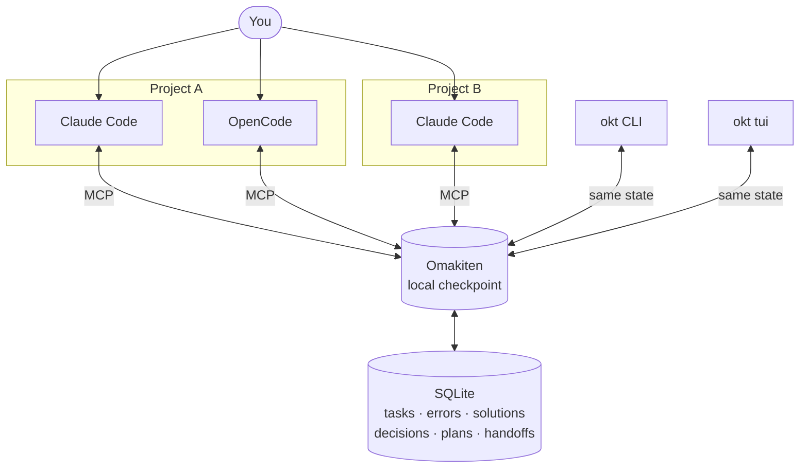
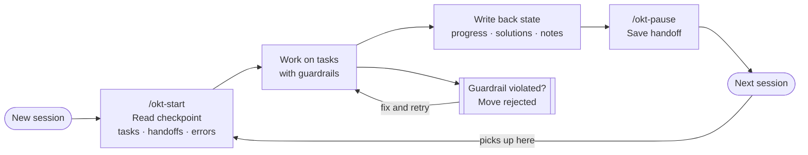

# Omakiten

**A checkpoint layer for AI-assisted development.**

Your AI agents forget everything when the session ends. Omakiten is the checkpoint they read before acting and write before leaving — so the next agent picks up from real state, not a blank slate.

[](https://github.com/This-Is-NPC/omakiten/releases)
[](LICENSE)

<p align="center">
  21 languages · 100% local · Open source · Zero telemetry
</p>

---

## The Problem

AI agents lose context between sessions. Different tools see different parts of your work. One agent rediscovers a bug another already fixed. You repeat the same explanation. They repeat the same mistake.

**Omakiten gives your agents a shared checkpoint:** tasks, decisions, errors, solutions, and handoff notes — in one place every agent can read and update.

---

## Before and After

**Before:** You explain the project from scratch to every agent. They suggest changes that break your team's process. The same error comes back because the previous fix lived only in a chat transcript.

**After:** Each agent reads the checkpoint before acting. Workflow rules are enforced at the shared state layer. Search crosses sessions and projects. Handoff notes survive. You spend less time repeating context and more time building.

---

## How It Works

You keep working with whichever AI tool you prefer. Omakiten runs locally and connects to your agents through MCP — a standard protocol that lets AI tools read and write shared state.


```mermaid
flowchart TB
    user([You])

    subgraph projectA[Project A]
        claudeA[Claude Code]
        opencodeA[OpenCode]
    end

    subgraph projectB[Project B]
        claudeB[Claude Code]
    end

    user --> claudeA
    user --> opencodeA
    user --> claudeB

    claudeA <-->|MCP| omakiten
    opencodeA <-->|MCP| omakiten
    claudeB <-->|MCP| omakiten

    cli[okt CLI] <-->|same state| omakiten
    tui[okt tui] <-->|same state| omakiten

    omakiten[(Omakiten<br/>local checkpoint)]
    db[(SQLite<br/>tasks · errors · solutions<br/>decisions · plans · handoffs)]

    omakiten <--> db
```

Claude Code, OpenCode, or any supported AI tool in any project — they all read from the same local checkpoint. No agent invents its own memory.

---

## Install

### Convenience install (not signature-verified)

These one-liners trust the installer script you just fetched and GitHub's TLS.
They are quick and they are the common path, but they are **not** end-to-end
verified — for that, use the [verified install](#verified-install-strict-mode)
below.

**Linux / macOS / WSL:**

```bash
curl -fsSL https://raw.githubusercontent.com/This-Is-NPC/omakiten/master/install.sh | bash
```

**Windows (PowerShell):**

```powershell
irm https://raw.githubusercontent.com/This-Is-NPC/omakiten/master/install.ps1 | iex
```

### Verified install (strict mode)

Strict mode authenticates the release before a single byte is extracted. It
requires a **Cosign you installed yourself**; the Bash installer also requires
`jq` for strict JSON/DSSE validation. The installer never downloads or
implicitly runs either prerequisite, and there is no unsigned fallback anywhere
inside strict mode. Install Cosign first (see
[sigstore/cosign releases](https://github.com/sigstore/cosign/releases)), then:

**Linux / macOS:**

```bash
cosign version   # must be v3.0.0 or newer; jq must also be on PATH
curl -fsSL -o install.sh https://raw.githubusercontent.com/This-Is-NPC/omakiten/master/install.sh
OKT_VERIFY_MODE=strict bash install.sh
```

**Windows amd64 (PowerShell):**

```powershell
cosign version   # must be v3.0.0 or newer
irm https://raw.githubusercontent.com/This-Is-NPC/omakiten/master/install.ps1 -OutFile install.ps1
$env:OKT_VERIFY_MODE = "strict"
.\install.ps1
```

**Windows arm64 (PowerShell):** Sigstore publishes no native `windows/arm64`
Cosign build. The supported arrangement is the signed `cosign-windows-amd64.exe`
running under Windows-on-ARM x64 emulation:

```powershell
# after placing cosign-windows-amd64.exe somewhere durable
$env:OKT_COSIGN = "C:\Tools\cosign-windows-amd64.exe"
& $env:OKT_COSIGN version   # must be v3.0.0 or newer
irm https://raw.githubusercontent.com/This-Is-NPC/omakiten/master/install.ps1 -OutFile install.ps1
$env:OKT_VERIFY_MODE = "strict"
.\install.ps1
```

Strict mode exits non-zero — **before any binary reaches the install
directory** — when Cosign is missing or older than `v3.0.0`, when a signature
bundle is missing or invalid, when the certificate identity or OIDC issuer is
not the pinned release-workflow pair, when the signed manifest is bound to a
different tag, or when the archive digest disagrees with the authenticated
metadata. Unsupported verifier/platform combinations fail with the guidance
above rather than degrading to the checksum path.

**Old releases are not installable in strict mode.** `v0.30.0` and everything
before it were published without signed metadata and can never be authenticated
after the fact, so strict mode refuses them outright. For an already-installed
`v0.30.0` binary, use its one-time immutable self-update transition to move to a
current release; binaries older than `v0.30.0` must be replaced with a verified
install of the first signed release.

Full trust model and the manual Cosign commands:
[CLI guide → Bootstrap trust model](.docs/cli.md#bootstrap-trust-model).

The installer walks you through language, workflow preset, and which AI tools to connect. For headless installs (CI, Docker, dotfiles):

```bash
OKT_CLI_LANG=en OKT_AGENT_LANG="English" OKT_PRESET=omakase OKT_HARNESSES=claude-code,opencode \
  bash <(curl -fsSL https://raw.githubusercontent.com/This-Is-NPC/omakiten/master/install.sh)
```

Supported tools: `claude-code`, `claude-desktop`, `codex`, `crush`, `github-copilot`, `opencode`.

In the default convenience mode both installers verify the downloaded release
archive's SHA-256 against the goreleaser-published `checksums.txt` **before**
extracting or running it. That is a corruption and swap check against the
served checksum file, not an authenticity check. By default, the checksum trust
root is pinned to `https://github.com/This-Is-NPC/omakiten/...` even when an
artifact download mirror is configured for tests or private release
infrastructure. A mirror can provide `checksums.txt` only with the explicit
opt-in `OKT_ALLOW_MIRROR_CHECKSUM=1` plus the separate `OKT_CHECKSUM_BASE=<mirror>`
override; enabling that means you trust the mirror for the checksum authority. A
checksum mismatch or unavailable pinned checksum aborts the install non-zero and
does not install or replace the binary in `INSTALL_DIR` (any binary already on
your PATH from a prior install is left untouched, not removed). Releases after
the legacy `v0.30.0` cutoff also publish a version-bound manifest, keyless Cosign
bundles for the manifest and `checksums.txt`, and SLSA v1 provenance for every
archive.

Both **strict** consumers of that metadata fail closed. `OKT_VERIFY_MODE=strict`
in the installers, and `okt update` in the binary, authenticate the signed
manifest, `checksums.txt`, and SLSA provenance — pinning the exact OIDC issuer
and release-workflow identity — before parsing a checksum or extracting an
archive. There is no unsigned fallback and no skip flag in either, mirrored
installs included: a mirror must serve matching authenticated metadata or the
install refuses. `okt update` additionally refuses downgrades, and both refuse
any target at or before the `v0.30.0` cutoff. A failed verification leaves the
installed binary byte-identical and places nothing new on your PATH. Moving off
a pre-cutoff binary is a verified reinstall of the first signed release, not a
self-update, except for an already-installed `v0.30.0` binary using its one-time
immutable transition. Older pre-cutoff binaries still require reinstall. Trust
models and manual Cosign commands:
[bootstrap](.docs/cli.md#bootstrap-trust-model) and
[update](.docs/cli.md#update-trust-model).

---

## Your First Project

```bash
# Register the current project
okt init --name MyProject --slug my-project

# Inspect the current state
okt list

# Open the visual board
okt tui
```

Once registered, tell your agent to start a session with `/okt-start`. It reads the checkpoint, surfaces what's pending, and suggests the next move. At the end, `/okt-pause` writes a handoff note — so the next session resumes from real state, not a blank slate.


```mermaid
flowchart LR
    start([New session])
    read["/okt-start\nRead checkpoint\ntasks · handoffs · errors"]
    work[Work on tasks\nwith guardrails]
    write[Write back state\nprogress · solutions · notes]
    pause["/okt-pause\nSave handoff"]
    next([Next session])

    start --> read --> work --> write --> pause --> next
    next -->|picks up here| read

    guard[[Guardrail violated?\nMove rejected]]
    work --> guard
    guard -->|fix and retry| work
```

---

## Talking to Your Agent

Once connected, agents understand natural language:

| What you say | What happens |
|---|---|
| "What is the state of this project?" | Agent reads the project checkpoint. |
| "Pick up where we left off." | Agent resumes from the last handoff. |
| "Move task 17 to review." | Agent moves it; workflow rules still apply. |
| "Have we seen this error before?" | Agent searches across all sessions and projects. |
| "That solution worked." | Agent marks the solution as confirmed. |

Agents also respond to structured slash commands for more precise control. [See the full command surface.](.docs/command-surface.md)

---

## Work Presets

Each preset is a work discipline — a set of rules and guardrails that apply to both you and your agents.

| Preset | Good for |
|---|---|
| **omakase** | Balanced default for professional software work. |
| **izakaya** | Prototypes, side projects, and low-ceremony experiments. |
| **kaiseki** | Planned features with multiple stakeholders and formal sign-offs. |
| **shokunin** | Regulated environments, irreversible changes, and audit-heavy work. |

Guards enforce the rules. If an agent tries to skip a required review step, the move is rejected with an explicit error — not a silent state change.

---

## TUI

`okt tui` opens a terminal board with three zones: **Tasks** (board, table, graph, plans), **Stats** (per-model usage, logs), and **Settings** (runtime info, entity browser).

Outside a project, it opens a multi-project home. Pick a project and the shell `cd`s into it when you exit.

[Read the TUI guide.](.docs/tui.md)

---

## Update and Uninstall

```bash
okt update --check    # check for updates without changing anything
okt update --yes      # download and swap the binary atomically

okt uninstall --yes             # remove binary and wrapper, keep data
okt uninstall --yes --purge     # remove everything, including data and config
```

---

## Documentation

| | |
|---|---|
| **Why Omakiten** | [`.docs/why_omakiten.md`](.docs/why_omakiten.md) |
| **Compare presets** | [`.docs/presets.md`](.docs/presets.md) |
| **Command surface** | [`.docs/command-surface.md`](.docs/command-surface.md) |
| **Configuration** | [`.docs/configuration-guide/README.md`](.docs/configuration-guide/README.md) |
| **CLI reference** | [`.docs/cli.md`](.docs/cli.md) |
| **MCP reference** | [`.docs/mcp.md`](.docs/mcp.md) |
| **Contributing** | [`.docs/internal/architecture.md`](.docs/internal/architecture.md) |

Master index: [`.docs/README.md`](.docs/README.md)

---

- [Changelog](CHANGELOG.md)
- [Contributing](CONTRIBUTING.md)
- [License](LICENSE)

<p align="center">
  <strong><a href="https://github.com/This-Is-NPC/omakiten/releases">Install now</a></strong>
  &nbsp;&middot;&nbsp;
  <strong><a href=".docs/why_omakiten.md">Read the manifesto</a></strong>
</p>
