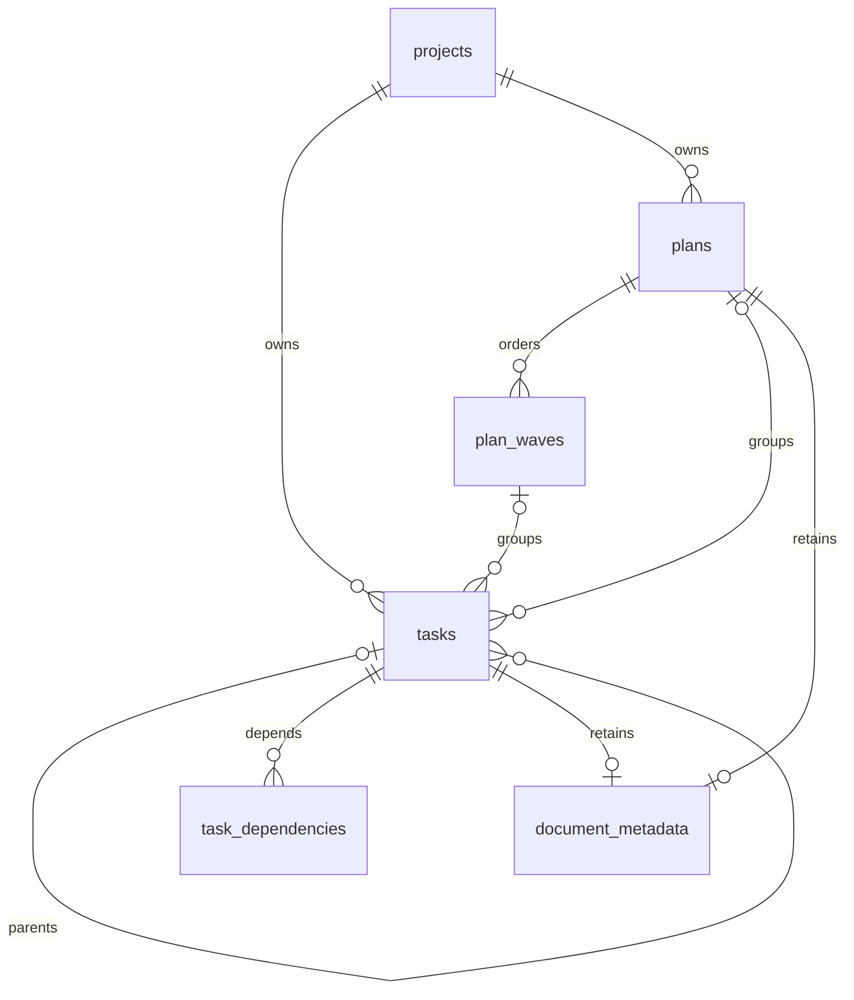

# What the database holds

The database contains operational work. Configuration packages, personas,
skills, laws, templates, and translation catalogs are file-backed or embedded
application assets. The schema source is `internal/sqlite/schema.sql`.

## Projects, tasks, and plans

| Table | Responsibility |
| --- | --- |
| `projects` | Unique slug and root, name, and description. |
| `tasks` | Project work, configured bucket and priority identities, lifecycle, parent, plan/wave, and assignee. |
| `plans` | Project-local plan slug, name, goal Markdown, and status. |
| `plan_waves` | Ordered groups inside a plan. |
| `task_dependencies` | Project-local directed blocker relationships. |
| `document_metadata` | One task or plan owner, with portable keys and producer extensions. |

Parent and dependency links cannot cross projects or form cycles. Bucket and
priority ids resolve through the project's configuration snapshot, rather
than configuration tables in SQLite. Completion follows the final bucket;
assignment is separate from bucket transitions.

Deleting a plan cascades its waves and detaches tasks. Task deletion follows
the operational cascade and records a pre-delete event snapshot. Project
deletion removes project events and work in its protected transaction.

## Comments, evidence, and reuse

| Table | Responsibility |
| --- | --- |
| `events` | Comments and typed domain/tool events, payload, scope, and provenance. |
| `tags` | Normalized reusable tag names and labels. |
| `task_tags`, `project_tags`, `event_tags` | Explicit tag relationships. |
| `errors` | Development failures, with optional originating project. |
| `solutions` | Proposed fixes, confirmation outcomes, and reuse counts. |
| `error_tags` | Tags for reusable failures. |

There is one event log. Comments are event records with their content and
scope; task, project, and universal scope are explicit. Event policy controls
logging, broadcast, hook dispatch, visibility, and retention. Cross-project
readers use each originating project's immutable event registry.

Errors and solutions can be reused across projects. A successful confirmation
increments a solution's reuse count. Agent model and session fields preserve
provenance; they do not decide permissions.

## Portable metadata

`document_metadata` has exactly one task or plan owner, enforced by its check
and unique owner constraints. Entity deletion cascades the metadata row.
The JSON payload retains document, profile, wave, and task extensions and
file-local keys. Current titles, descriptions, relationships, and tags remain
in the business tables.

Import writes both in one transaction. Export combines the current business
state with retained metadata under one consistent read snapshot.

## Search and recovery

`search_index` is an FTS5 virtual table populated from canonical operational
records. `okt db check` tests logical and internal index integrity. Confirmed
reindex creates a verified recovery image and performs reset, insertion, and
post-checks in one transaction. Readers do not see an empty intermediate index.

SQLite enables foreign keys and uses WAL. A live snapshot includes committed
WAL data. Filesystem-backed opens validate paths and file identity before
schema or WAL mutation. Supported schema changes are applied transactionally;
an unsupported database returns a validation error.

[Backup and recovery](../how-to-back-up-and-recover.md) explains using the
snapshot commands. [Design](design.md) explains transaction and adapter ownership.
