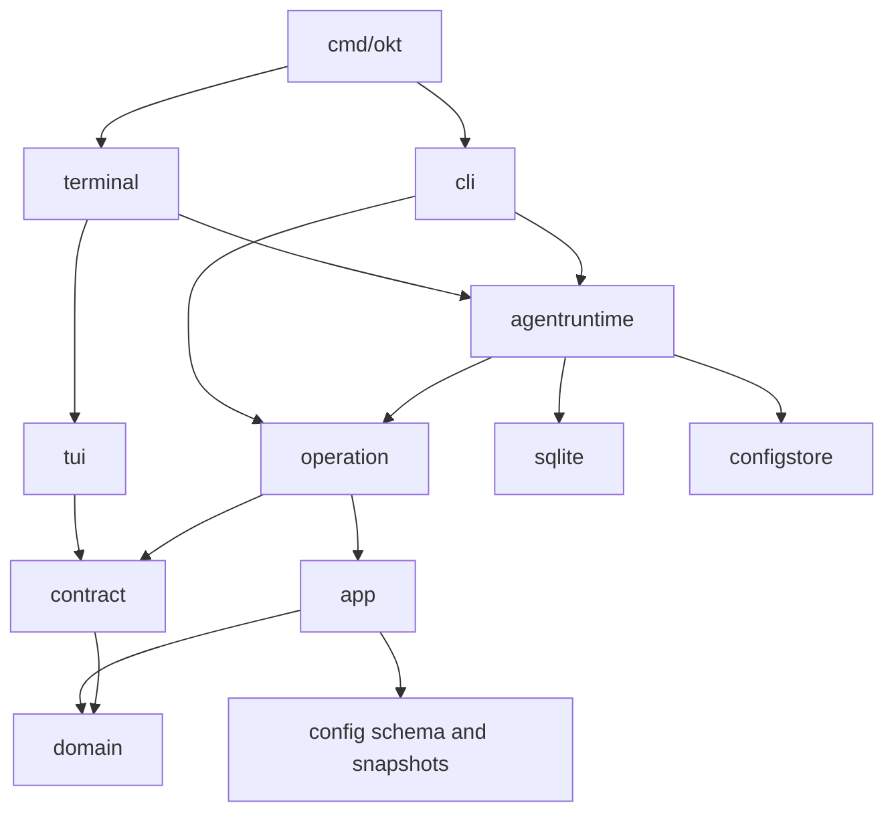

# How it is built

This page is for contributors. The [how-to pages](../README.md) describe using
the product; this one explains which module owns a behavior and how a change
reaches its consumers.

## 1. The model

Omakiten is a local checkpoint store. A project owns tasks, comments, plans,
and their relationships. A workflow package supplies policy and instruction
assets. Application preferences supply language choices across projects.

SQLite stores operational work. Files store workflow packages. The application
builds an immutable configuration snapshot for each project runtime. No SQL
preset registry is needed to activate an installed package.

## 2. Ports and adapters

The domain imports no other internal package. Application services reach I/O
through ports. SQLite and configuration storage are leaf adapters, isolated
from each other.

TUI imports no CLI, concrete operation service, runtime, or storage adapter.
`internal/terminal` binds its ports and starts Bubble Tea. CLI receives an
injected interactive runner and imports no TUI. The executable composes both.

| Owner | Responsibility |
| --- | --- |
| `internal/domain` | Business entities, errors, event metadata, and slug policy. |
| `internal/app` | Services, business validation, guards, and repository/editor ports. |
| `internal/contract` | Shared delivery DTOs and narrow operation/recovery ports. |
| `internal/operation` | Surface-gated operations around application services. |
| `internal/cli` | Cobra contracts, help, completion, scope selection, and output. |
| `internal/terminal` | Production bindings for interactive ports. |
| `internal/tui` | Host, routes, screen state, overlays, and asynchronous delivery. |
| `internal/config` | Package schema, loading, validation, identities, and snapshots. |
| `internal/configstore` | Filesystem adapter for staged package and asset edits. |
| `internal/sqlite` | Transactions, operational queries, events, and live snapshots. |
| `internal/agentruntime` | Bootstrap, per-project runtime cache, reload, and shutdown. |
| `internal/workfile` | Bounded UTF-8 OKF Markdown codec. |
| `internal/knowledgefile` | File-backed Markdown, OpenAPI, and CLI knowledge reader. |
| `internal/recovery` | Recovery images, directory leases, and retention. |
| `internal/installer`, `internal/updater` | Package capture, setup, and executable updates. |
| `internal/releaseverify`, `internal/releasemeta` | Release verification policy and metadata. |

`internal/arch` enforces import boundaries; `.golangci.yml` mirrors production
restrictions. Shared projections belong outside delivery implementations.

## 3. Configuration publication

`BundleCache` owns one project runtime per project id. Its construction path
creates the snapshot, registries, operation services, editor, and hook engine.
Services capture coherent snapshot values rather than mutable process globals.

Reload prepares an inactive candidate and asks consumers to accept their staged
replacement. It drains the previous hook engine before publishing the new
runtime. Rejection keeps the accepted runtime intact; failed drain leaves the
candidate unpublished. Close rejects rebuilds and drains cached engines before
closing the database.

Package editing stages the complete package, validates it, installs its new
content identity, and atomically updates the scope's selection. Application
preferences are watched independently of preset edit hashes. Translation
catalogs are embedded and cached; consumers receive independent values.

## 4. Work documents and transactions

CLI passes decoded document values through operation contracts to
`app.WorkDocumentService`. The repository transaction covers plan, waves,
tasks, tags, parent links, dependencies, and document metadata.

SQLite binds nested mutations to the transaction context and buffers event
publication. Commit makes the mutations durable before publishing events.
Failure and dry-run roll back the mutations and their events. Export hydrates
the complete record under a consistent transaction snapshot.

Business fields remain in their operational tables. Entity-owned document
metadata preserves file-local keys and producer extensions; export combines
both. The [data model](data-model.md) describes the relationships.

Project knowledge is separate from operational work documents. Its readers
build an in-memory projection from registered project files on each explicit
read or TUI refresh. CLI command inventories are exported from executable
command trees into generated files under `.tmp/`; Markdown frontmatter attaches
guides to commands or OpenAPI operations by stable ID. The TUI prepares focused
interface neighborhoods from those relations. No knowledge node or relation is
written to SQLite.

## 5. Events and hooks

Each project's snapshot owns event definitions and policy. SQLite prepares
event category, display, summary, and visibility before delivery. Cross-project
log and metric queries interpret events against their originating policy.

The event bus dispatches hooks; each runtime owns an engine and action registry.
Admission, cancellation, and bounded drain belong to the engine. Notification
actions contain structured operation arguments; terminal bindings execute
them without invoking Cobra or parsing CLI output.

## 6. Presentation ownership

The screen registry declares routes, labels, factories, chrome, and reload
policy. The host keeps a base screen, detail stack, and navigation history.
Screens receive prepared business projections and emit semantic intents.

Components own cursor, scroll, viewport, geometry, and framing. Screens declare
content, archetypes, styles, and keys. Rendering consumes prepared state.
[TUI screen assembly](tui-screen-assembly.md) is the normative contract.

## 7. Recovery and release boundaries

Project deletion and confirmed search reindex use a directory lease and a live
SQLite snapshot before mutation. A pinned connection verifies the database
generation around the transaction. Recovery images include committed WAL data.
Retention follows the same protected directory identity.

The updater verifies release metadata and stages the executable replacement
on the destination filesystem. Strict installers validate signer identity,
provenance, manifest, and archive digests before extraction. Preset installation
validates package integrity and schema, without evaluating script content.

Filesystem validation retains user symlinks for rejection. On macOS, the system
aliases `/var`, `/tmp`, and `/etc` resolve to their corresponding `/private/`
directories before descriptor-relative access. Windows opens synchronous NT
handles with synchronization access and uses Win32 error codes for missing
targets and name collisions.

## Next

- [Working on Omakiten](development.md) — toolchain, tests, gate, and releases.
- [Behavioral requirements](requirements.md) — the invariants a change must preserve.
- [Review guide](review-guide.md) — how to turn evidence into a review finding.
